# Treasury Kondor (Solution)


## Delivery Metrics 


### Overview 

#### Distribution of priorities across projects

The [Tree Map](https://en.wikipedia.org/wiki/Treemapping) of the entire dataset
provides an excellent solution level overview of the total number of 
work items (Stories) that flowed in across different projects and priorities.


<div class="figure" style="text-align: center">
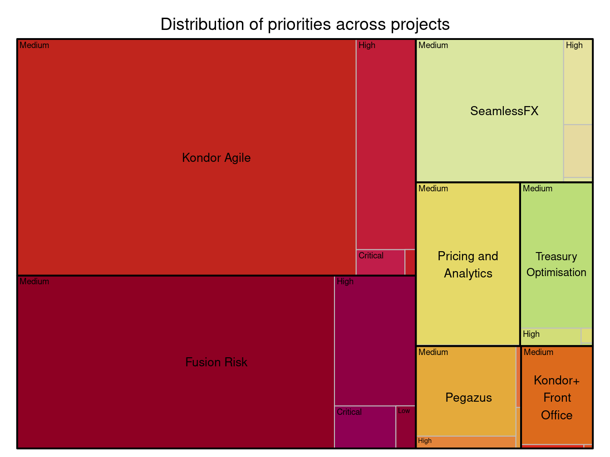
<p class="caption">(\#fig:trk-stories-summary-treemap-fig)Summary Tree Map</p>
</div>


###  Cycle Time


#### Summary

The below [Five-number summary](https://en.wikipedia.org/wiki/Five-number_summary) 
will provide a high level distribution of the cycle times. 
The 75% Qartile value is significant because that is the number which you can 
typically see as the turn around time (TAT) to service a work item.

<table class="table table-striped" style="width: auto !important; margin-left: auto; margin-right: auto;">
<caption>(\#tab:trk-cycle-time-summ)5 Number Summary</caption>
 <thead>
  <tr>
   <th style="text-align:left;"> Type </th>
   <th style="text-align:left;"> Priority </th>
   <th style="text-align:right;"> Count </th>
   <th style="text-align:right;"> Min </th>
   <th style="text-align:right;"> LoQ </th>
   <th style="text-align:right;"> Med </th>
   <th style="text-align:right;"> UpQ </th>
   <th style="text-align:right;"> Max </th>
  </tr>
 </thead>
<tbody>
  <tr>
   <td style="text-align:left;"> Epic </td>
   <td style="text-align:left;"> Critical </td>
   <td style="text-align:right;"> 33 </td>
   <td style="text-align:right;"> 3 </td>
   <td style="text-align:right;"> 62.00 </td>
   <td style="text-align:right;"> 111.0 </td>
   <td style="text-align:right;"> 160.00 </td>
   <td style="text-align:right;"> 281 </td>
  </tr>
  <tr>
   <td style="text-align:left;"> Epic </td>
   <td style="text-align:left;"> High </td>
   <td style="text-align:right;"> 158 </td>
   <td style="text-align:right;"> 1 </td>
   <td style="text-align:right;"> 77.00 </td>
   <td style="text-align:right;"> 104.0 </td>
   <td style="text-align:right;"> 166.75 </td>
   <td style="text-align:right;"> 487 </td>
  </tr>
  <tr>
   <td style="text-align:left;"> Epic </td>
   <td style="text-align:left;"> Medium </td>
   <td style="text-align:right;"> 670 </td>
   <td style="text-align:right;"> 1 </td>
   <td style="text-align:right;"> 78.00 </td>
   <td style="text-align:right;"> 103.0 </td>
   <td style="text-align:right;"> 149.00 </td>
   <td style="text-align:right;"> 487 </td>
  </tr>
  <tr>
   <td style="text-align:left;"> Epic </td>
   <td style="text-align:left;"> Low </td>
   <td style="text-align:right;"> 2 </td>
   <td style="text-align:right;"> 252 </td>
   <td style="text-align:right;"> 252.25 </td>
   <td style="text-align:right;"> 252.5 </td>
   <td style="text-align:right;"> 252.75 </td>
   <td style="text-align:right;"> 253 </td>
  </tr>
  <tr>
   <td style="text-align:left;"> Story </td>
   <td style="text-align:left;"> Critical </td>
   <td style="text-align:right;"> 134 </td>
   <td style="text-align:right;"> 1 </td>
   <td style="text-align:right;"> 25.25 </td>
   <td style="text-align:right;"> 59.5 </td>
   <td style="text-align:right;"> 106.75 </td>
   <td style="text-align:right;"> 315 </td>
  </tr>
  <tr>
   <td style="text-align:left;"> Story </td>
   <td style="text-align:left;"> High </td>
   <td style="text-align:right;"> 527 </td>
   <td style="text-align:right;"> 1 </td>
   <td style="text-align:right;"> 34.00 </td>
   <td style="text-align:right;"> 68.0 </td>
   <td style="text-align:right;"> 104.50 </td>
   <td style="text-align:right;"> 435 </td>
  </tr>
  <tr>
   <td style="text-align:left;"> Story </td>
   <td style="text-align:left;"> Medium </td>
   <td style="text-align:right;"> 3514 </td>
   <td style="text-align:right;"> 1 </td>
   <td style="text-align:right;"> 28.00 </td>
   <td style="text-align:right;"> 63.0 </td>
   <td style="text-align:right;"> 99.00 </td>
   <td style="text-align:right;"> 483 </td>
  </tr>
  <tr>
   <td style="text-align:left;"> Story </td>
   <td style="text-align:left;"> Low </td>
   <td style="text-align:right;"> 16 </td>
   <td style="text-align:right;"> 2 </td>
   <td style="text-align:right;"> 47.50 </td>
   <td style="text-align:right;"> 107.0 </td>
   <td style="text-align:right;"> 167.50 </td>
   <td style="text-align:right;"> 357 </td>
  </tr>
</tbody>
</table>

#### Epics


<div class="figure" style="text-align: center">
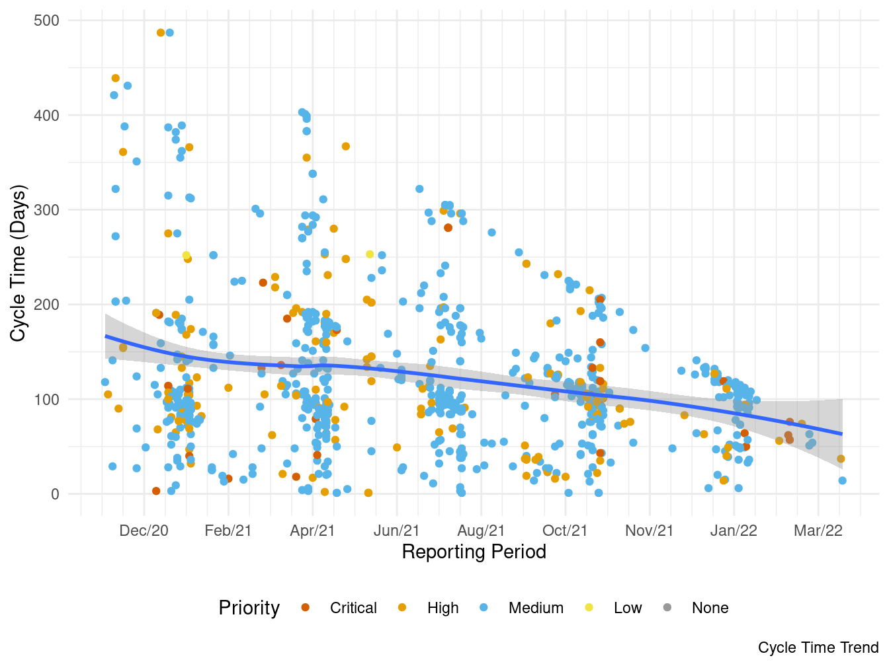
<p class="caption">(\#fig:trk-epics-cycle-time-trend-fig)Cycle Time Trend</p>
</div>


<table class="table table-striped" style="width: auto !important; margin-left: auto; margin-right: auto;">
<caption>(\#tab:trk-epics-summary-metrics)5 Number Summary</caption>
 <thead>
  <tr>
   <th style="text-align:left;"> Type </th>
   <th style="text-align:left;"> Priority </th>
   <th style="text-align:right;"> Count </th>
   <th style="text-align:right;"> Min </th>
   <th style="text-align:right;"> LoQ </th>
   <th style="text-align:right;"> Med </th>
   <th style="text-align:right;"> UpQ </th>
   <th style="text-align:right;"> Max </th>
  </tr>
 </thead>
<tbody>
  <tr>
   <td style="text-align:left;"> Epic </td>
   <td style="text-align:left;"> Critical </td>
   <td style="text-align:right;"> 33 </td>
   <td style="text-align:right;"> 3 </td>
   <td style="text-align:right;"> 62.00 </td>
   <td style="text-align:right;"> 111.0 </td>
   <td style="text-align:right;"> 160.00 </td>
   <td style="text-align:right;"> 281 </td>
  </tr>
  <tr>
   <td style="text-align:left;"> Epic </td>
   <td style="text-align:left;"> High </td>
   <td style="text-align:right;"> 158 </td>
   <td style="text-align:right;"> 1 </td>
   <td style="text-align:right;"> 77.00 </td>
   <td style="text-align:right;"> 104.0 </td>
   <td style="text-align:right;"> 166.75 </td>
   <td style="text-align:right;"> 487 </td>
  </tr>
  <tr>
   <td style="text-align:left;"> Epic </td>
   <td style="text-align:left;"> Medium </td>
   <td style="text-align:right;"> 670 </td>
   <td style="text-align:right;"> 1 </td>
   <td style="text-align:right;"> 78.00 </td>
   <td style="text-align:right;"> 103.0 </td>
   <td style="text-align:right;"> 149.00 </td>
   <td style="text-align:right;"> 487 </td>
  </tr>
  <tr>
   <td style="text-align:left;"> Epic </td>
   <td style="text-align:left;"> Low </td>
   <td style="text-align:right;"> 2 </td>
   <td style="text-align:right;"> 252 </td>
   <td style="text-align:right;"> 252.25 </td>
   <td style="text-align:right;"> 252.5 </td>
   <td style="text-align:right;"> 252.75 </td>
   <td style="text-align:right;"> 253 </td>
  </tr>
</tbody>
</table>

#### Stories

<div class="figure" style="text-align: center">
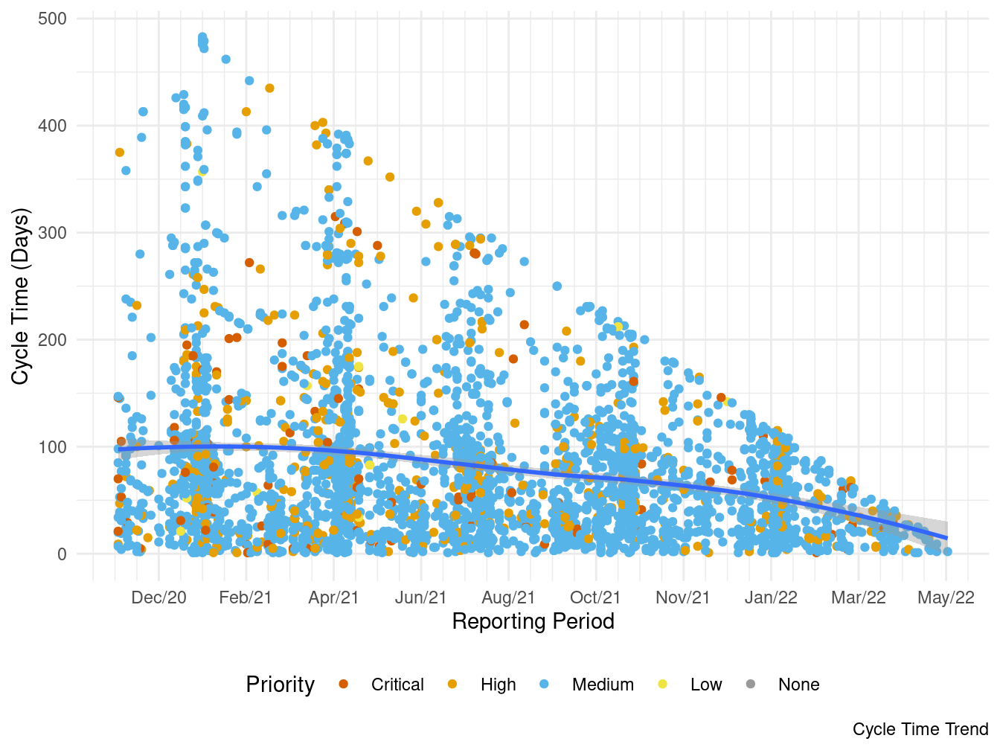
<p class="caption">(\#fig:trk-stories-cycle-time-trend-fig)Cycle Time Trend</p>
</div>


<table class="table table-striped" style="width: auto !important; margin-left: auto; margin-right: auto;">
<caption>(\#tab:trk-story-summary-metrics)5 Number Summary</caption>
 <thead>
  <tr>
   <th style="text-align:left;"> Type </th>
   <th style="text-align:left;"> Priority </th>
   <th style="text-align:right;"> Count </th>
   <th style="text-align:right;"> Min </th>
   <th style="text-align:right;"> LoQ </th>
   <th style="text-align:right;"> Med </th>
   <th style="text-align:right;"> UpQ </th>
   <th style="text-align:right;"> Max </th>
  </tr>
 </thead>
<tbody>
  <tr>
   <td style="text-align:left;"> Story </td>
   <td style="text-align:left;"> Critical </td>
   <td style="text-align:right;"> 134 </td>
   <td style="text-align:right;"> 1 </td>
   <td style="text-align:right;"> 25.25 </td>
   <td style="text-align:right;"> 59.5 </td>
   <td style="text-align:right;"> 106.75 </td>
   <td style="text-align:right;"> 315 </td>
  </tr>
  <tr>
   <td style="text-align:left;"> Story </td>
   <td style="text-align:left;"> High </td>
   <td style="text-align:right;"> 527 </td>
   <td style="text-align:right;"> 1 </td>
   <td style="text-align:right;"> 34.00 </td>
   <td style="text-align:right;"> 68.0 </td>
   <td style="text-align:right;"> 104.50 </td>
   <td style="text-align:right;"> 435 </td>
  </tr>
  <tr>
   <td style="text-align:left;"> Story </td>
   <td style="text-align:left;"> Medium </td>
   <td style="text-align:right;"> 3514 </td>
   <td style="text-align:right;"> 1 </td>
   <td style="text-align:right;"> 28.00 </td>
   <td style="text-align:right;"> 63.0 </td>
   <td style="text-align:right;"> 99.00 </td>
   <td style="text-align:right;"> 483 </td>
  </tr>
  <tr>
   <td style="text-align:left;"> Story </td>
   <td style="text-align:left;"> Low </td>
   <td style="text-align:right;"> 16 </td>
   <td style="text-align:right;"> 2 </td>
   <td style="text-align:right;"> 47.50 </td>
   <td style="text-align:right;"> 107.0 </td>
   <td style="text-align:right;"> 167.50 </td>
   <td style="text-align:right;"> 357 </td>
  </tr>
</tbody>
</table>

### Throughput

#### Epics

<div class="figure" style="text-align: center">
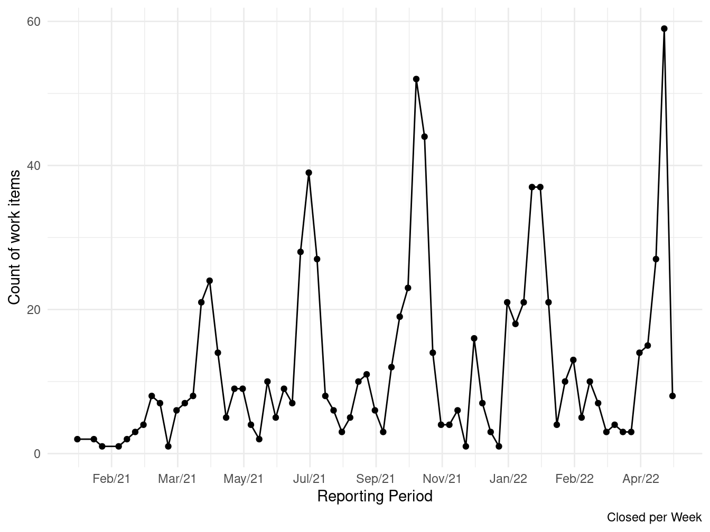
<p class="caption">(\#fig:trk-completed-epics-week-fig)Closed Epics by Week</p>
</div>

The plot below shows the number of epics closed in every week, marked separately in different color based on priority

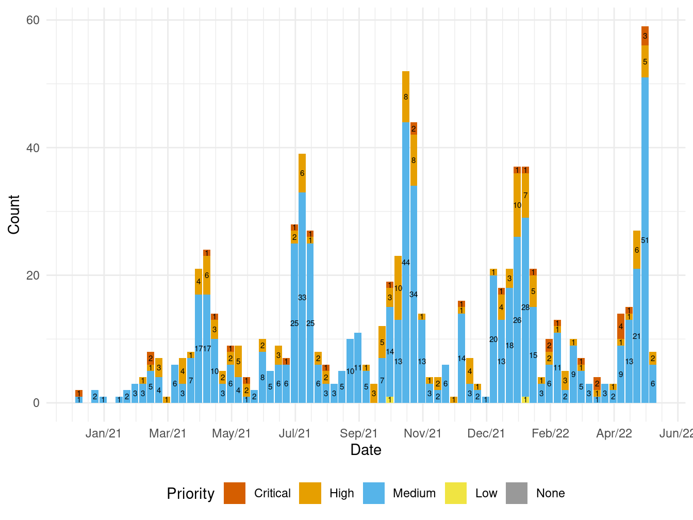


<!-- - Density distribution -->

<!-- Gives and indication of the densities especially the occurrence of multiple maxima in the data. This can be due to multiple categories of work items which may be investigated further.  -->

<!-- ```{r trk-density-distibution-closed-epics-fig, include=TRUE, echo=FALSE, out.width="80%", fig.align="center", fig.asp=.75, fig.cap="Priority based Density Distribution", message=FALSE, warning=FALSE} -->
<!-- epics.closed %>% violin_plot.CycleTimeVsPriority() -->
<!-- ``` -->


#### Stories


Tells us the number of work items (stories) completed aggregated for each 
week which is an indication of how stable the throughput is.

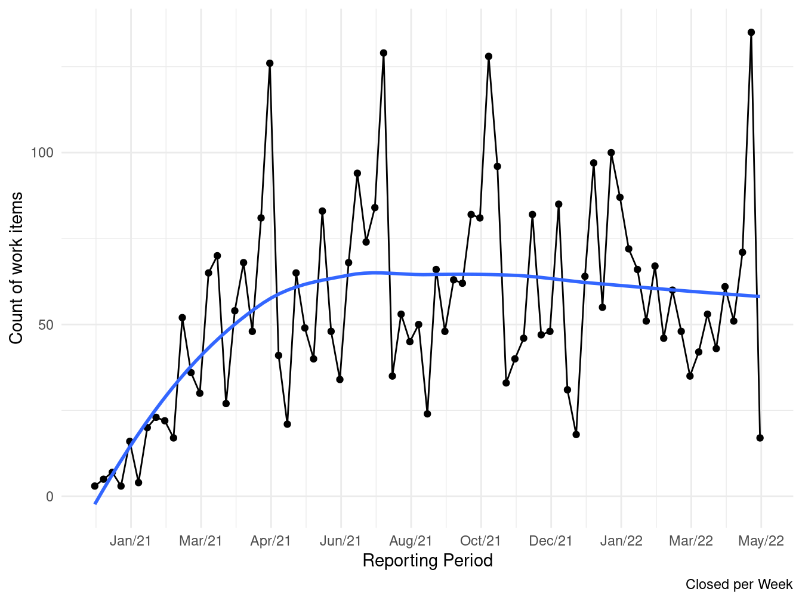

The plot below shows the number of stories closed in every week, marked separately in different color based on priority


<div class="figure" style="text-align: center">
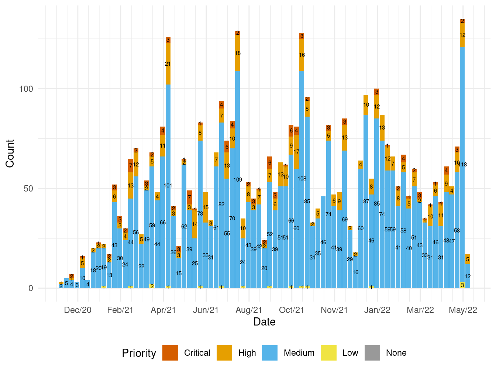
<p class="caption">(\#fig:trk-stories-wk-agg-fig)Number of Stories Closed in a Week colored by Priority</p>
</div>

- Density distribution

Gives and indication of the densities especially the occurrence of multiple maxima in the data. This can be due to multiple categories of work items which may be investigated further. 

<div class="figure" style="text-align: center">
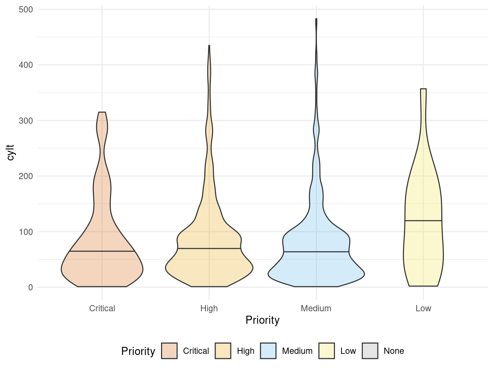
<p class="caption">(\#fig:trk-density-distibution-closed-stories-fig)Priority based Density Distribution</p>
</div>


### Flow

#### Work in Progress (WiP)

##### Epics 


<div class="figure" style="text-align: center">

<p class="caption">(\#fig:trk-epics-work-in-progress-fig )WiP in Days</p>
</div>

##### Stories


<div class="figure" style="text-align: center">

<p class="caption">(\#fig:trk-stories-work-in-progress-fig )WiP in Days</p>
</div>

#### Inflow/OutFlow

##### Epics

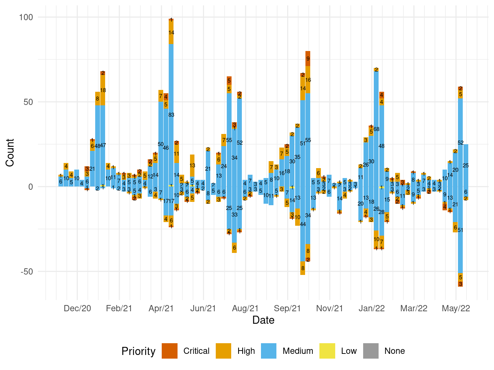

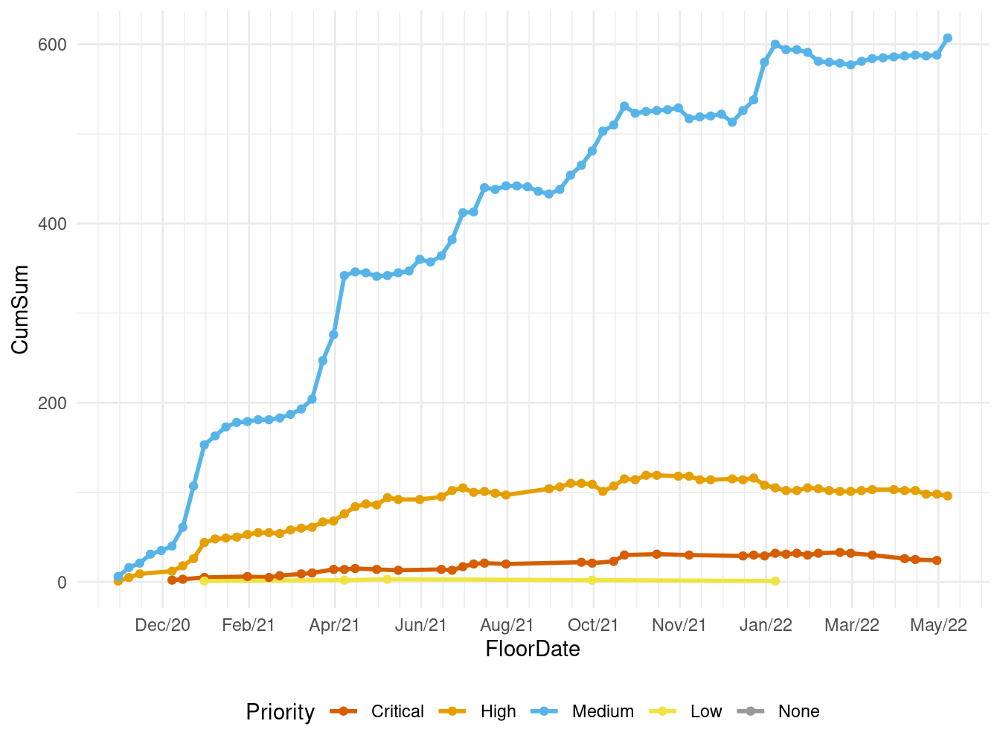


```{=html}
<style type="text/css">
.plot-fill { width: 80%; height: 100%; }
.center {
                          display: block; 
                          margin-left: auto; 
                          margin-right: auto;
                        }
#left_plt { float: left; background-color: #ccffcc;  }
#right_plt { float: right; background-color: #ccffcc; }
#center_plt { float: center; background-color: #ccffcc; }
</style>
<div id="center_plt" class="plot-fill center">
<div id="htmlwidget-b0547d3910e2cf8582b9" style="width:100%;height:400px;" class="plotly html-widget"></div>
<script type="application/json" data-for="htmlwidget-b0547d3910e2cf8582b9">{"x":{"visdat":{"637d97776a":["function () ","plotlyVisDat"]},"cur_data":"637d97776a","attrs":{"637d97776a":{"x":{},"y":{},"mode":"lines+markers","color":{},"colors":["#D55E00","#E69F00","#56B4E9","#F0E442","#999999"],"alpha_stroke":1,"sizes":[10,100],"spans":[1,20],"type":"scatter"}},"layout":{"margin":{"b":40,"l":60,"t":25,"r":10},"legend":{"orientation":"h","xanchor":"center","x":0.5,"y":-0.2},"xaxis":{"domain":[0,1],"automargin":true,"title":"FloorDate"},"yaxis":{"domain":[0,1],"automargin":true,"title":"CumSum"},"hovermode":"closest","showlegend":true},"source":"A","config":{"modeBarButtonsToAdd":["hoverclosest","hovercompare"],"showSendToCloud":false,"displaylogo":false,"modeBarButtonsToRemove":["zoomIn2d","zoomOut2d"]},"data":[{"x":["2021-01-24","2021-04-25","2021-05-23","2021-10-03","2022-01-30"],"y":[1,2,3,2,1],"mode":"lines+markers","type":"scatter","name":"Low","marker":{"color":"rgba(240,228,66,1)","line":{"color":"rgba(240,228,66,1)"}},"textfont":{"color":"rgba(240,228,66,1)"},"error_y":{"color":"rgba(240,228,66,1)"},"error_x":{"color":"rgba(240,228,66,1)"},"line":{"color":"rgba(240,228,66,1)"},"xaxis":"x","yaxis":"y","frame":null},{"x":["2020-11-29","2020-12-06","2020-12-13","2020-12-20","2020-12-27","2021-01-03","2021-01-10","2021-01-17","2021-01-24","2021-01-31","2021-02-07","2021-02-14","2021-02-21","2021-02-28","2021-03-07","2021-03-14","2021-03-21","2021-03-28","2021-04-04","2021-04-11","2021-04-18","2021-04-25","2021-05-02","2021-05-09","2021-05-16","2021-05-23","2021-05-30","2021-06-06","2021-06-13","2021-06-20","2021-06-27","2021-07-04","2021-07-11","2021-07-18","2021-07-25","2021-08-01","2021-08-08","2021-08-15","2021-08-22","2021-08-29","2021-09-05","2021-09-12","2021-09-19","2021-09-26","2021-10-03","2021-10-10","2021-10-17","2021-10-24","2021-10-31","2021-11-07","2021-11-14","2021-11-21","2021-11-28","2021-12-05","2021-12-12","2021-12-19","2021-12-26","2022-01-02","2022-01-09","2022-01-16","2022-01-23","2022-01-30","2022-02-06","2022-02-13","2022-02-20","2022-02-27","2022-03-06","2022-03-13","2022-03-20","2022-03-27","2022-04-03","2022-04-10","2022-04-17","2022-04-24","2022-05-01","2022-05-08","2022-05-15","2022-05-22"],"y":[6,16,21,31,35,40,61,107,153,163,173,178,179,181,181,183,187,193,204,247,276,342,346,345,341,342,345,347,360,357,364,382,412,413,440,438,442,442,441,436,433,438,454,465,481,503,510,531,523,525,526,527,529,517,519,520,522,513,526,538,580,600,594,594,591,581,580,579,577,581,584,585,586,587,588,587,588,607],"mode":"lines+markers","type":"scatter","name":"Medium","marker":{"color":"rgba(86,180,233,1)","line":{"color":"rgba(86,180,233,1)"}},"textfont":{"color":"rgba(86,180,233,1)"},"error_y":{"color":"rgba(86,180,233,1)"},"error_x":{"color":"rgba(86,180,233,1)"},"line":{"color":"rgba(86,180,233,1)"},"xaxis":"x","yaxis":"y","frame":null},{"x":["2020-11-29","2020-12-06","2020-12-13","2021-01-03","2021-01-10","2021-01-17","2021-01-24","2021-01-31","2021-02-07","2021-02-14","2021-02-21","2021-02-28","2021-03-07","2021-03-14","2021-03-21","2021-03-28","2021-04-04","2021-04-11","2021-04-18","2021-04-25","2021-05-02","2021-05-09","2021-05-16","2021-05-23","2021-05-30","2021-06-13","2021-06-27","2021-07-04","2021-07-11","2021-07-18","2021-07-25","2021-08-01","2021-08-08","2021-09-05","2021-09-12","2021-09-19","2021-09-26","2021-10-03","2021-10-10","2021-10-17","2021-10-24","2021-10-31","2021-11-07","2021-11-14","2021-11-28","2021-12-05","2021-12-12","2021-12-19","2022-01-02","2022-01-09","2022-01-16","2022-01-23","2022-01-30","2022-02-06","2022-02-13","2022-02-20","2022-02-27","2022-03-06","2022-03-13","2022-03-20","2022-03-27","2022-04-03","2022-04-17","2022-04-24","2022-05-01","2022-05-08","2022-05-15","2022-05-22"],"y":[1,5,9,12,18,26,44,48,49,50,53,55,55,54,58,60,61,67,68,76,84,87,86,94,92,92,95,102,105,100,101,99,97,104,106,110,110,109,101,107,115,114,119,119,118,118,114,114,115,114,116,108,105,102,102,105,104,102,101,101,102,103,103,102,102,98,98,96],"mode":"lines+markers","type":"scatter","name":"High","marker":{"color":"rgba(230,159,0,1)","line":{"color":"rgba(230,159,0,1)"}},"textfont":{"color":"rgba(230,159,0,1)"},"error_y":{"color":"rgba(230,159,0,1)"},"error_x":{"color":"rgba(230,159,0,1)"},"line":{"color":"rgba(230,159,0,1)"},"xaxis":"x","yaxis":"y","frame":null},{"x":["2021-01-03","2021-01-10","2021-01-24","2021-02-21","2021-03-07","2021-03-14","2021-03-28","2021-04-04","2021-04-18","2021-04-25","2021-05-02","2021-05-16","2021-05-30","2021-06-27","2021-07-04","2021-07-11","2021-07-18","2021-07-25","2021-08-08","2021-09-26","2021-10-03","2021-10-17","2021-10-24","2021-11-14","2021-12-05","2022-01-09","2022-01-16","2022-01-23","2022-01-30","2022-02-06","2022-02-13","2022-02-20","2022-02-27","2022-03-13","2022-03-20","2022-04-03","2022-04-24","2022-05-01","2022-05-15"],"y":[2,3,5,6,5,7,9,10,14,14,15,14,13,14,13,17,20,21,20,22,21,23,30,31,30,29,30,29,32,31,32,30,32,33,32,30,26,25,24],"mode":"lines+markers","type":"scatter","name":"Critical","marker":{"color":"rgba(213,94,0,1)","line":{"color":"rgba(213,94,0,1)"}},"textfont":{"color":"rgba(213,94,0,1)"},"error_y":{"color":"rgba(213,94,0,1)"},"error_x":{"color":"rgba(213,94,0,1)"},"line":{"color":"rgba(213,94,0,1)"},"xaxis":"x","yaxis":"y","frame":null}],"highlight":{"on":"plotly_click","persistent":false,"dynamic":false,"selectize":false,"opacityDim":0.2,"selected":{"opacity":1},"debounce":0},"shinyEvents":["plotly_hover","plotly_click","plotly_selected","plotly_relayout","plotly_brushed","plotly_brushing","plotly_clickannotation","plotly_doubleclick","plotly_deselect","plotly_afterplot","plotly_sunburstclick"],"base_url":"https://plot.ly"},"evals":[],"jsHooks":[]}</script>
</div>
```


```{=html}
<div id="htmlwidget-d8ae18bcc3f0d8d8ae32" style="width:100%;height:auto;" class="datatables html-widget"></div>
<script type="application/json" data-for="htmlwidget-d8ae18bcc3f0d8d8ae32">{"x":{"filter":"top","vertical":false,"filterHTML":"<tr>\n  <td><\/td>\n  <td data-type=\"date\" style=\"vertical-align: top;\">\n    <div class=\"form-group has-feedback\" style=\"margin-bottom: auto;\">\n      <input type=\"search\" placeholder=\"All\" class=\"form-control\" style=\"width: 100%;\"/>\n      <span class=\"glyphicon glyphicon-remove-circle form-control-feedback\"><\/span>\n    <\/div>\n    <div style=\"display: none;position: absolute;width: 200px;opacity: 1\">\n      <div data-min=\"1.606608e+12\" data-max=\"1653177600000\"><\/div>\n      <span style=\"float: left;\"><\/span>\n      <span style=\"float: right;\"><\/span>\n    <\/div>\n  <\/td>\n  <td data-type=\"factor\" style=\"vertical-align: top;\">\n    <div class=\"form-group has-feedback\" style=\"margin-bottom: auto;\">\n      <input type=\"search\" placeholder=\"All\" class=\"form-control\" style=\"width: 100%;\"/>\n      <span class=\"glyphicon glyphicon-remove-circle form-control-feedback\"><\/span>\n    <\/div>\n    <div style=\"width: 100%; display: none;\">\n      <select multiple=\"multiple\" style=\"width: 100%;\" data-options=\"[&quot;Critical&quot;,&quot;High&quot;,&quot;Medium&quot;,&quot;Low&quot;,&quot;None&quot;]\"><\/select>\n    <\/div>\n  <\/td>\n  <td data-type=\"number\" style=\"vertical-align: top;\">\n    <div class=\"form-group has-feedback\" style=\"margin-bottom: auto;\">\n      <input type=\"search\" placeholder=\"All\" class=\"form-control\" style=\"width: 100%;\"/>\n      <span class=\"glyphicon glyphicon-remove-circle form-control-feedback\"><\/span>\n    <\/div>\n    <div style=\"display: none;position: absolute;width: 200px;opacity: 1\">\n      <div data-min=\"0\" data-max=\"83\"><\/div>\n      <span style=\"float: left;\"><\/span>\n      <span style=\"float: right;\"><\/span>\n    <\/div>\n  <\/td>\n  <td data-type=\"number\" style=\"vertical-align: top;\">\n    <div class=\"form-group has-feedback\" style=\"margin-bottom: auto;\">\n      <input type=\"search\" placeholder=\"All\" class=\"form-control\" style=\"width: 100%;\"/>\n      <span class=\"glyphicon glyphicon-remove-circle form-control-feedback\"><\/span>\n    <\/div>\n    <div style=\"display: none;position: absolute;width: 200px;opacity: 1\">\n      <div data-min=\"0\" data-max=\"51\"><\/div>\n      <span style=\"float: left;\"><\/span>\n      <span style=\"float: right;\"><\/span>\n    <\/div>\n  <\/td>\n  <td data-type=\"number\" style=\"vertical-align: top;\">\n    <div class=\"form-group has-feedback\" style=\"margin-bottom: auto;\">\n      <input type=\"search\" placeholder=\"All\" class=\"form-control\" style=\"width: 100%;\"/>\n      <span class=\"glyphicon glyphicon-remove-circle form-control-feedback\"><\/span>\n    <\/div>\n    <div style=\"display: none;position: absolute;width: 200px;opacity: 1\">\n      <div data-min=\"1\" data-max=\"607\"><\/div>\n      <span style=\"float: left;\"><\/span>\n      <span style=\"float: right;\"><\/span>\n    <\/div>\n  <\/td>\n<\/tr>","data":[["1","2","3","4","5","6","7","8","9","10","11","12","13","14","15","16","17","18","19","20","21","22","23","24","25","26","27","28","29","30","31","32","33","34","35","36","37","38","39","40","41","42","43","44","45","46","47","48","49","50","51","52","53","54","55","56","57","58","59","60","61","62","63","64","65","66","67","68","69","70","71","72","73","74","75","76","77","78","79","80","81","82","83","84","85","86","87","88","89","90","91","92","93","94","95","96","97","98","99","100","101","102","103","104","105","106","107","108","109","110","111","112","113","114","115","116","117","118","119","120","121","122","123","124","125","126","127","128","129","130","131","132","133","134","135","136","137","138","139","140","141","142","143","144","145","146","147","148","149","150","151","152","153","154","155","156","157","158","159","160","161","162","163","164","165","166","167","168","169","170","171","172","173","174","175","176","177","178","179","180","181","182","183","184","185","186","187","188","189","190"],["2020-11-29","2020-11-29","2020-12-06","2020-12-06","2020-12-13","2020-12-13","2020-12-20","2020-12-27","2021-01-03","2021-01-03","2021-01-03","2021-01-10","2021-01-10","2021-01-10","2021-01-17","2021-01-17","2021-01-24","2021-01-24","2021-01-24","2021-01-24","2021-01-31","2021-01-31","2021-02-07","2021-02-07","2021-02-14","2021-02-14","2021-02-21","2021-02-21","2021-02-21","2021-02-28","2021-02-28","2021-03-07","2021-03-07","2021-03-07","2021-03-14","2021-03-14","2021-03-14","2021-03-21","2021-03-21","2021-03-28","2021-03-28","2021-03-28","2021-04-04","2021-04-04","2021-04-04","2021-04-11","2021-04-11","2021-04-18","2021-04-18","2021-04-18","2021-04-25","2021-04-25","2021-04-25","2021-04-25","2021-05-02","2021-05-02","2021-05-02","2021-05-09","2021-05-09","2021-05-16","2021-05-16","2021-05-16","2021-05-23","2021-05-23","2021-05-23","2021-05-30","2021-05-30","2021-05-30","2021-06-06","2021-06-13","2021-06-13","2021-06-20","2021-06-27","2021-06-27","2021-06-27","2021-07-04","2021-07-04","2021-07-04","2021-07-11","2021-07-11","2021-07-11","2021-07-18","2021-07-18","2021-07-18","2021-07-25","2021-07-25","2021-07-25","2021-08-01","2021-08-01","2021-08-08","2021-08-08","2021-08-08","2021-08-15","2021-08-22","2021-08-29","2021-09-05","2021-09-05","2021-09-12","2021-09-12","2021-09-19","2021-09-19","2021-09-26","2021-09-26","2021-09-26","2021-10-03","2021-10-03","2021-10-03","2021-10-03","2021-10-10","2021-10-10","2021-10-17","2021-10-17","2021-10-17","2021-10-24","2021-10-24","2021-10-24","2021-10-31","2021-10-31","2021-11-07","2021-11-07","2021-11-14","2021-11-14","2021-11-14","2021-11-21","2021-11-28","2021-11-28","2021-12-05","2021-12-05","2021-12-05","2021-12-12","2021-12-12","2021-12-19","2021-12-19","2021-12-26","2022-01-02","2022-01-02","2022-01-09","2022-01-09","2022-01-09","2022-01-16","2022-01-16","2022-01-16","2022-01-23","2022-01-23","2022-01-23","2022-01-30","2022-01-30","2022-01-30","2022-01-30","2022-02-06","2022-02-06","2022-02-06","2022-02-13","2022-02-13","2022-02-13","2022-02-20","2022-02-20","2022-02-20","2022-02-27","2022-02-27","2022-02-27","2022-03-06","2022-03-06","2022-03-13","2022-03-13","2022-03-13","2022-03-20","2022-03-20","2022-03-20","2022-03-27","2022-03-27","2022-04-03","2022-04-03","2022-04-03","2022-04-10","2022-04-17","2022-04-17","2022-04-24","2022-04-24","2022-04-24","2022-05-01","2022-05-01","2022-05-01","2022-05-08","2022-05-08","2022-05-15","2022-05-15","2022-05-15","2022-05-22","2022-05-22"],["High","Medium","High","Medium","High","Medium","Medium","Medium","Critical","High","Medium","Critical","High","Medium","High","Medium","Critical","High","Medium","Low","High","Medium","High","Medium","High","Medium","Critical","High","Medium","High","Medium","Critical","High","Medium","Critical","High","Medium","High","Medium","Critical","High","Medium","Critical","High","Medium","High","Medium","Critical","High","Medium","Critical","High","Medium","Low","Critical","High","Medium","High","Medium","Critical","High","Medium","High","Medium","Low","Critical","High","Medium","Medium","High","Medium","Medium","Critical","High","Medium","Critical","High","Medium","Critical","High","Medium","Critical","High","Medium","Critical","High","Medium","High","Medium","Critical","High","Medium","Medium","Medium","Medium","High","Medium","High","Medium","High","Medium","Critical","High","Medium","Critical","High","Medium","Low","High","Medium","Critical","High","Medium","Critical","High","Medium","High","Medium","High","Medium","Critical","High","Medium","Medium","High","Medium","Critical","High","Medium","High","Medium","High","Medium","Medium","High","Medium","Critical","High","Medium","Critical","High","Medium","Critical","High","Medium","Critical","High","Medium","Low","Critical","High","Medium","Critical","High","Medium","Critical","High","Medium","Critical","High","Medium","High","Medium","Critical","High","Medium","Critical","High","Medium","High","Medium","Critical","High","Medium","Medium","High","Medium","Critical","High","Medium","Critical","High","Medium","High","Medium","Critical","High","Medium","High","Medium"],[1,6,4,10,4,5,10,4,3,3,6,1,6,21,8,48,2,18,47,1,4,10,1,11,1,7,1,3,4,3,5,1,1,5,2,2,6,5,4,2,2,12,1,5,14,7,50,4,5,46,1,14,83,1,2,11,14,5,2,0,1,2,13,5,1,0,0,4,4,2,21,2,1,6,13,0,7,24,5,5,55,3,1,34,2,2,52,0,4,0,0,7,3,4,5,7,8,3,10,7,16,2,5,18,0,2,30,0,2,35,2,14,51,9,16,55,0,5,6,5,1,2,3,7,0,2,0,1,2,0,5,1,3,3,2,11,0,3,26,1,5,30,0,2,68,4,4,48,0,0,2,9,1,1,3,0,5,3,3,0,1,1,1,1,0,8,0,1,3,1,7,0,2,4,4,1,3,0,0,10,0,1,14,2,20,2,5,52,0,25],[0,0,0,0,0,0,0,0,1,0,1,0,0,0,0,2,0,0,1,0,0,0,0,1,0,2,0,0,3,1,3,2,1,5,0,3,4,1,0,0,0,6,0,4,3,1,7,0,4,17,1,6,17,0,1,3,10,2,3,1,2,6,5,4,0,1,2,1,2,2,8,5,0,3,6,1,0,6,1,2,25,0,6,33,1,1,25,2,6,1,2,3,3,5,10,0,11,1,5,3,0,0,5,7,1,3,14,1,10,13,0,8,44,2,8,34,1,13,1,3,0,2,2,6,1,0,1,1,14,4,3,1,2,1,1,20,1,4,13,0,3,18,1,10,26,1,7,28,1,1,5,15,0,1,3,2,2,6,1,1,11,3,2,0,1,9,1,1,5,0,3,2,1,1,3,1,2,4,1,9,1,1,13,6,21,3,5,51,2,6],[1,6,5,16,9,21,31,35,2,12,40,3,18,61,26,107,5,44,153,1,48,163,49,173,50,178,6,53,179,55,181,5,55,181,7,54,183,58,187,9,60,193,10,61,204,67,247,14,68,276,14,76,342,2,15,84,346,87,345,14,86,341,94,342,3,13,92,345,347,92,360,357,14,95,364,13,102,382,17,105,412,20,100,413,21,101,440,99,438,20,97,442,442,441,436,104,433,106,438,110,454,22,110,465,21,109,481,2,101,503,23,107,510,30,115,531,114,523,119,525,31,119,526,527,118,529,30,118,517,114,519,114,520,522,115,513,29,114,526,30,116,538,29,108,580,32,105,600,1,31,102,594,32,102,594,30,105,591,32,104,581,102,580,33,101,579,32,101,577,102,581,30,103,584,585,103,586,26,102,587,25,102,588,98,587,24,98,588,96,607]],"container":"<table class=\"display\">\n  <thead>\n    <tr>\n      <th> <\/th>\n      <th>FloorDate<\/th>\n      <th>Priority<\/th>\n      <th>Opened<\/th>\n      <th>Closed<\/th>\n      <th>CumSum<\/th>\n    <\/tr>\n  <\/thead>\n<\/table>","options":{"columnDefs":[{"className":"dt-right","targets":[3,4,5]},{"orderable":false,"targets":0}],"order":[],"autoWidth":false,"orderClasses":false,"orderCellsTop":true}},"evals":[],"jsHooks":[]}</script>
```
##### Stories

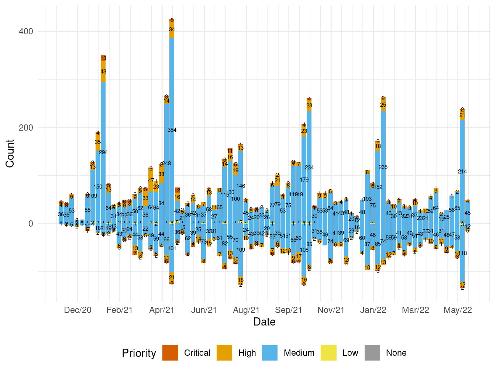

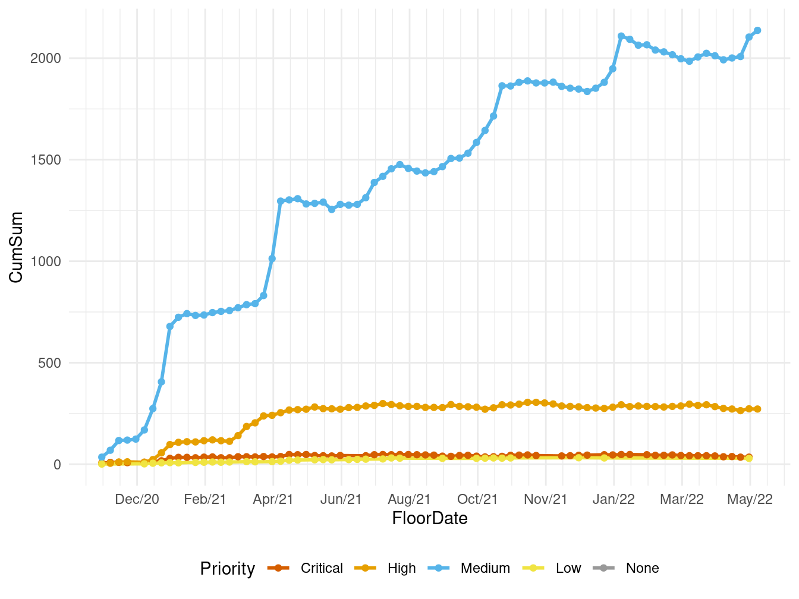

## Defect Metrics


### Overview 

#### Distribution of priorities across projects


<div class="figure" style="text-align: center">
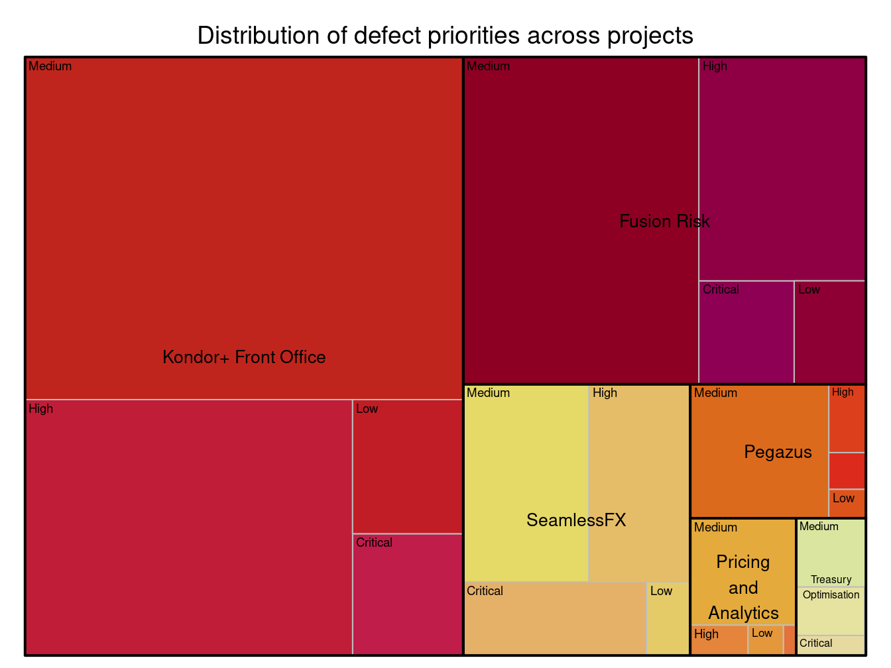
<p class="caption">(\#fig:trk-defects-summary-treemap-fig)Summary Tree Map</p>
</div>

###  Cycle Time

Below is the [5 Number Summary](https://en.wikipedia.org/wiki/Five-number_summary) 
of the entire data set. The 75% Qartile value is significant because that is the 
number which you can typically see as the turn around time (TAT) to service a defect.

#### Summary

<table class="table table-striped" style="width: auto !important; margin-left: auto; margin-right: auto;">
<caption>(\#tab:trk-defects-tab-cycle-time-basic-stats)5 Number Summary</caption>
 <thead>
  <tr>
   <th style="text-align:right;"> Min </th>
   <th style="text-align:right;"> LoQ </th>
   <th style="text-align:right;"> Med </th>
   <th style="text-align:right;"> UpQ </th>
   <th style="text-align:right;"> Max </th>
  </tr>
 </thead>
<tbody>
  <tr>
   <td style="text-align:right;"> 1 </td>
   <td style="text-align:right;"> 12 </td>
   <td style="text-align:right;"> 28 </td>
   <td style="text-align:right;"> 62.5 </td>
   <td style="text-align:right;"> 517 </td>
  </tr>
</tbody>
</table>


#### Cycle Time Trend

This reflects the capacity/capability of the team to resolve across all 
priorities as indicated by a trend.

<div class="figure" style="text-align: center">
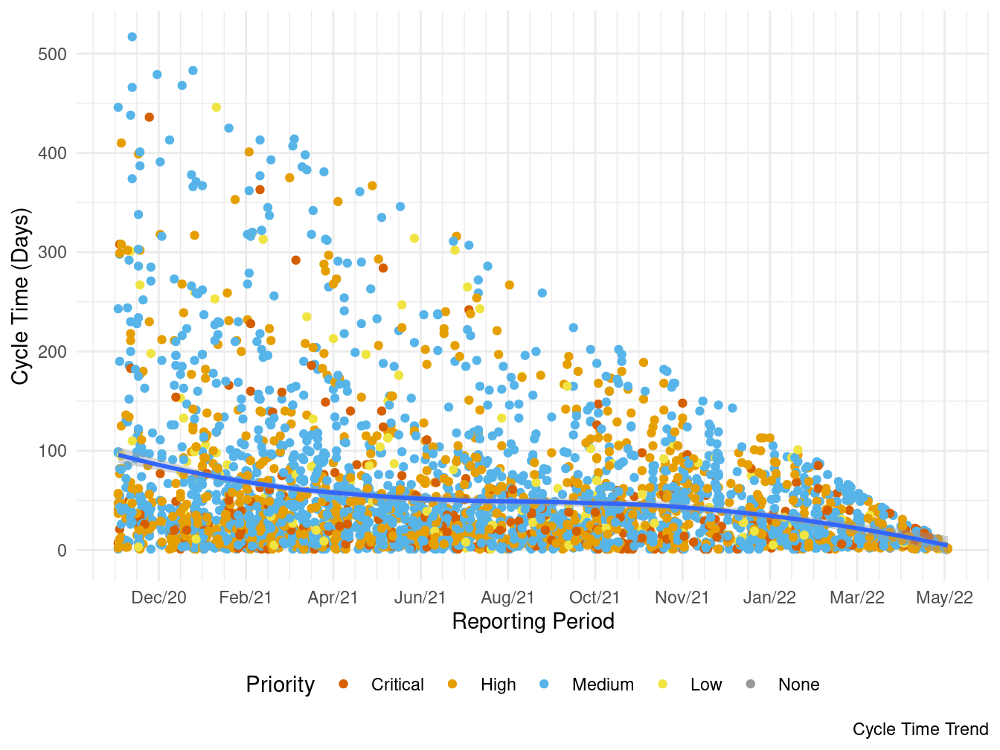
<p class="caption">(\#fig:trk-defects-cycle-time-trend-all)All Severities</p>
</div>


#### 5 Number Summary

<table class="table table-striped" style="width: auto !important; margin-left: auto; margin-right: auto;">
<caption>(\#tab:trk-defects-cycle-time-summary)All Severities</caption>
 <thead>
  <tr>
   <th style="text-align:left;"> Type </th>
   <th style="text-align:left;"> Priority </th>
   <th style="text-align:right;"> Count </th>
   <th style="text-align:right;"> Min </th>
   <th style="text-align:right;"> LoQ </th>
   <th style="text-align:right;"> Med </th>
   <th style="text-align:right;"> UpQ </th>
   <th style="text-align:right;"> Max </th>
  </tr>
 </thead>
<tbody>
  <tr>
   <td style="text-align:left;"> Epic </td>
   <td style="text-align:left;"> Critical </td>
   <td style="text-align:right;"> 33 </td>
   <td style="text-align:right;"> 3 </td>
   <td style="text-align:right;"> 62.00 </td>
   <td style="text-align:right;"> 111.0 </td>
   <td style="text-align:right;"> 160.00 </td>
   <td style="text-align:right;"> 281 </td>
  </tr>
  <tr>
   <td style="text-align:left;"> Epic </td>
   <td style="text-align:left;"> High </td>
   <td style="text-align:right;"> 158 </td>
   <td style="text-align:right;"> 1 </td>
   <td style="text-align:right;"> 77.00 </td>
   <td style="text-align:right;"> 104.0 </td>
   <td style="text-align:right;"> 166.75 </td>
   <td style="text-align:right;"> 487 </td>
  </tr>
  <tr>
   <td style="text-align:left;"> Epic </td>
   <td style="text-align:left;"> Medium </td>
   <td style="text-align:right;"> 670 </td>
   <td style="text-align:right;"> 1 </td>
   <td style="text-align:right;"> 78.00 </td>
   <td style="text-align:right;"> 103.0 </td>
   <td style="text-align:right;"> 149.00 </td>
   <td style="text-align:right;"> 487 </td>
  </tr>
  <tr>
   <td style="text-align:left;"> Epic </td>
   <td style="text-align:left;"> Low </td>
   <td style="text-align:right;"> 2 </td>
   <td style="text-align:right;"> 252 </td>
   <td style="text-align:right;"> 252.25 </td>
   <td style="text-align:right;"> 252.5 </td>
   <td style="text-align:right;"> 252.75 </td>
   <td style="text-align:right;"> 253 </td>
  </tr>
  <tr>
   <td style="text-align:left;"> Story </td>
   <td style="text-align:left;"> Critical </td>
   <td style="text-align:right;"> 134 </td>
   <td style="text-align:right;"> 1 </td>
   <td style="text-align:right;"> 25.25 </td>
   <td style="text-align:right;"> 59.5 </td>
   <td style="text-align:right;"> 106.75 </td>
   <td style="text-align:right;"> 315 </td>
  </tr>
  <tr>
   <td style="text-align:left;"> Story </td>
   <td style="text-align:left;"> High </td>
   <td style="text-align:right;"> 527 </td>
   <td style="text-align:right;"> 1 </td>
   <td style="text-align:right;"> 34.00 </td>
   <td style="text-align:right;"> 68.0 </td>
   <td style="text-align:right;"> 104.50 </td>
   <td style="text-align:right;"> 435 </td>
  </tr>
  <tr>
   <td style="text-align:left;"> Story </td>
   <td style="text-align:left;"> Medium </td>
   <td style="text-align:right;"> 3514 </td>
   <td style="text-align:right;"> 1 </td>
   <td style="text-align:right;"> 28.00 </td>
   <td style="text-align:right;"> 63.0 </td>
   <td style="text-align:right;"> 99.00 </td>
   <td style="text-align:right;"> 483 </td>
  </tr>
  <tr>
   <td style="text-align:left;"> Story </td>
   <td style="text-align:left;"> Low </td>
   <td style="text-align:right;"> 16 </td>
   <td style="text-align:right;"> 2 </td>
   <td style="text-align:right;"> 47.50 </td>
   <td style="text-align:right;"> 107.0 </td>
   <td style="text-align:right;"> 167.50 </td>
   <td style="text-align:right;"> 357 </td>
  </tr>
</tbody>
</table>

<div class="figure" style="text-align: center">
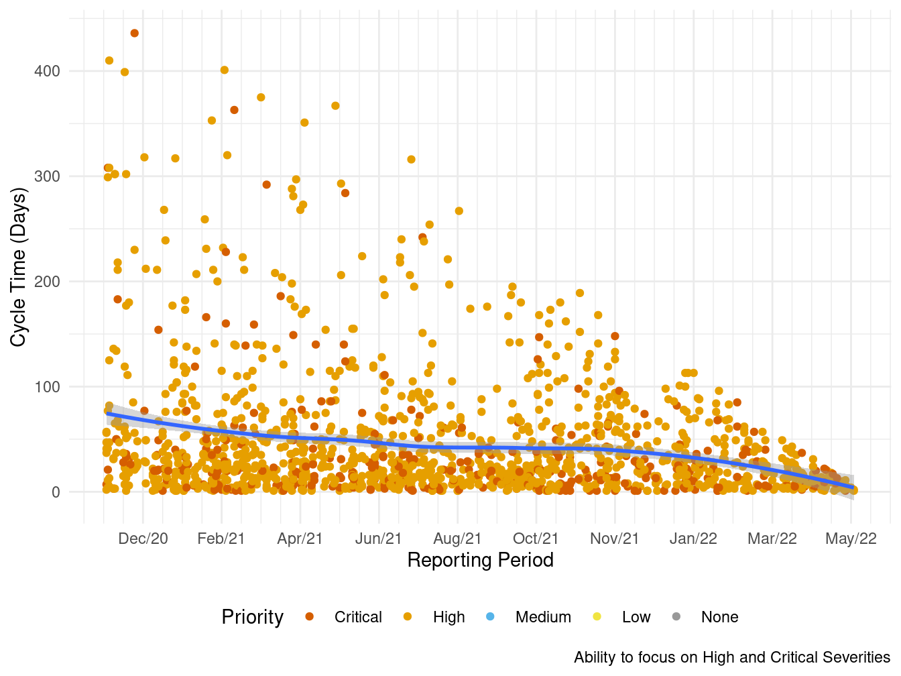
<p class="caption">(\#fig:trk-defects-cycle-time-trend-for-hnc)High and Critical</p>
</div>


<table class="table table-striped" style="width: auto !important; margin-left: auto; margin-right: auto;">
<caption>(\#tab:trk-defects-cycle-time-stat-for-high-and-critical)5 Number Summary for High and Critical Defects</caption>
 <thead>
  <tr>
   <th style="text-align:left;"> Type </th>
   <th style="text-align:left;"> Priority </th>
   <th style="text-align:right;"> Count </th>
   <th style="text-align:right;"> Min </th>
   <th style="text-align:right;"> LoQ </th>
   <th style="text-align:right;"> Med </th>
   <th style="text-align:right;"> UpQ </th>
   <th style="text-align:right;"> Max </th>
  </tr>
 </thead>
<tbody>
  <tr>
   <td style="text-align:left;"> Defect </td>
   <td style="text-align:left;"> Critical </td>
   <td style="text-align:right;"> 374 </td>
   <td style="text-align:right;"> 1 </td>
   <td style="text-align:right;"> 6 </td>
   <td style="text-align:right;"> 17 </td>
   <td style="text-align:right;"> 35.75 </td>
   <td style="text-align:right;"> 436 </td>
  </tr>
  <tr>
   <td style="text-align:left;"> Defect </td>
   <td style="text-align:left;"> High </td>
   <td style="text-align:right;"> 1224 </td>
   <td style="text-align:right;"> 1 </td>
   <td style="text-align:right;"> 12 </td>
   <td style="text-align:right;"> 27 </td>
   <td style="text-align:right;"> 59.00 </td>
   <td style="text-align:right;"> 410 </td>
  </tr>
</tbody>
</table>


### Throughput


<div class="figure" style="text-align: center">
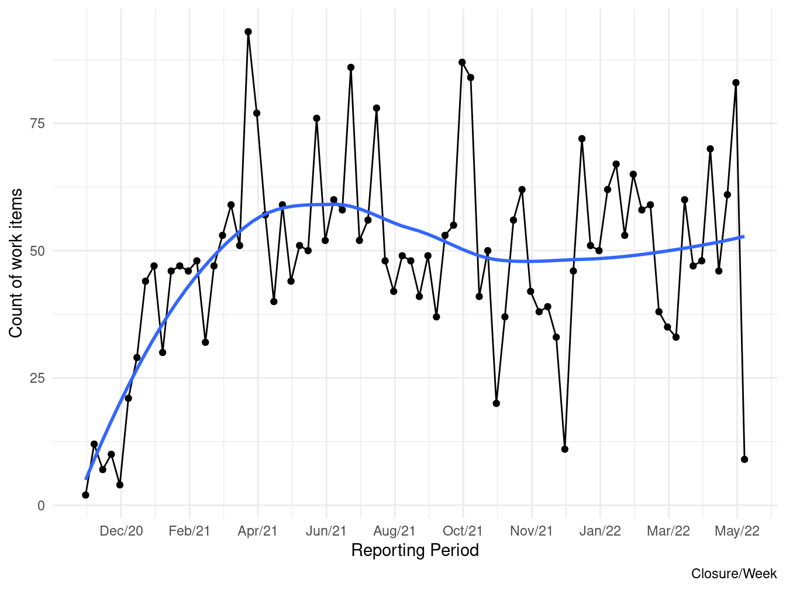
<p class="caption">(\#fig:trk-defects-closed-metric-for-each-week)Closure metrics - All Defects</p>
</div>


<div class="figure" style="text-align: center">
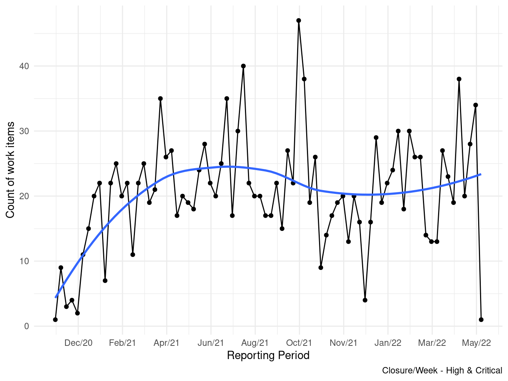
<p class="caption">(\#fig:trk-defects-fig-completed-hnc-defects-week)Closed defects by Week</p>
</div>


The plot below shows the number of defects closed in every week, marked separately in different color based on priority


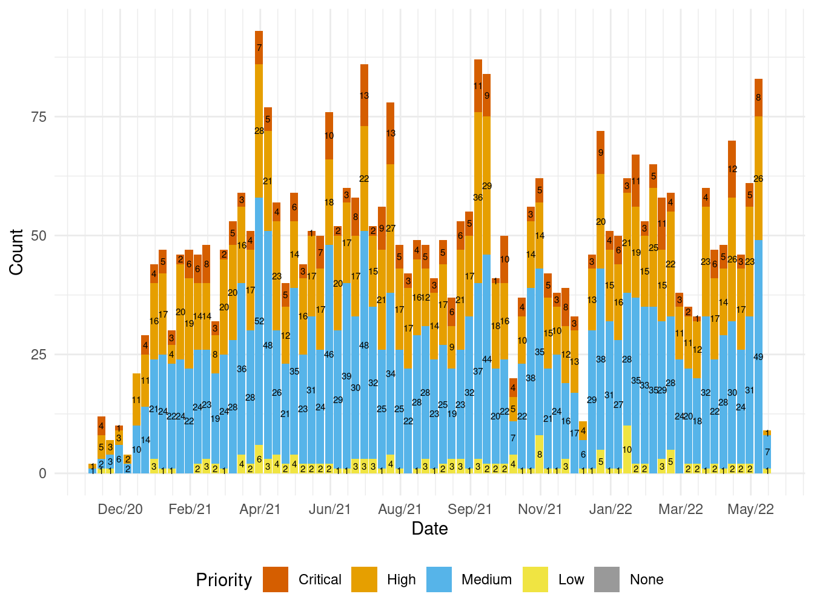

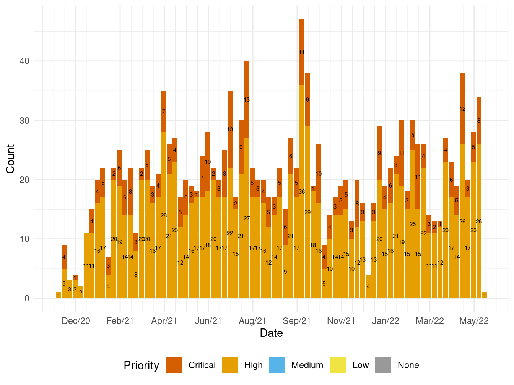


```{=html}
<div id="htmlwidget-e8db087ba2a9d901610e" style="width:100%;height:auto;" class="datatables html-widget"></div>
<script type="application/json" data-for="htmlwidget-e8db087ba2a9d901610e">{"x":{"filter":"top","vertical":false,"filterHTML":"<tr>\n  <td><\/td>\n  <td data-type=\"date\" style=\"vertical-align: top;\">\n    <div class=\"form-group has-feedback\" style=\"margin-bottom: auto;\">\n      <input type=\"search\" placeholder=\"All\" class=\"form-control\" style=\"width: 100%;\"/>\n      <span class=\"glyphicon glyphicon-remove-circle form-control-feedback\"><\/span>\n    <\/div>\n    <div style=\"display: none;position: absolute;width: 200px;opacity: 1\">\n      <div data-min=\"1.606608e+12\" data-max=\"1653177600000\"><\/div>\n      <span style=\"float: left;\"><\/span>\n      <span style=\"float: right;\"><\/span>\n    <\/div>\n  <\/td>\n  <td data-type=\"factor\" style=\"vertical-align: top;\">\n    <div class=\"form-group has-feedback\" style=\"margin-bottom: auto;\">\n      <input type=\"search\" placeholder=\"All\" class=\"form-control\" style=\"width: 100%;\"/>\n      <span class=\"glyphicon glyphicon-remove-circle form-control-feedback\"><\/span>\n    <\/div>\n    <div style=\"width: 100%; display: none;\">\n      <select multiple=\"multiple\" style=\"width: 100%;\" data-options=\"[&quot;Critical&quot;,&quot;High&quot;,&quot;Medium&quot;,&quot;Low&quot;,&quot;None&quot;]\"><\/select>\n    <\/div>\n  <\/td>\n  <td data-type=\"integer\" style=\"vertical-align: top;\">\n    <div class=\"form-group has-feedback\" style=\"margin-bottom: auto;\">\n      <input type=\"search\" placeholder=\"All\" class=\"form-control\" style=\"width: 100%;\"/>\n      <span class=\"glyphicon glyphicon-remove-circle form-control-feedback\"><\/span>\n    <\/div>\n    <div style=\"display: none;position: absolute;width: 200px;opacity: 1\">\n      <div data-min=\"1\" data-max=\"52\"><\/div>\n      <span style=\"float: left;\"><\/span>\n      <span style=\"float: right;\"><\/span>\n    <\/div>\n  <\/td>\n<\/tr>","data":[["1","2","3","4","5","6","7","8","9","10","11","12","13","14","15","16","17","18","19","20","21","22","23","24","25","26","27","28","29","30","31","32","33","34","35","36","37","38","39","40","41","42","43","44","45","46","47","48","49","50","51","52","53","54","55","56","57","58","59","60","61","62","63","64","65","66","67","68","69","70","71","72","73","74","75","76","77","78","79","80","81","82","83","84","85","86","87","88","89","90","91","92","93","94","95","96","97","98","99","100","101","102","103","104","105","106","107","108","109","110","111","112","113","114","115","116","117","118","119","120","121","122","123","124","125","126","127","128","129","130","131","132","133","134","135","136","137","138","139","140","141","142","143","144","145","146","147","148","149","150","151","152","153","154","155","156","157","158","159","160","161","162","163","164","165","166","167","168","169","170","171","172","173","174","175","176","177","178","179","180","181","182","183","184","185","186","187","188","189","190","191","192","193","194","195","196","197","198","199","200","201","202","203","204","205","206","207","208","209","210","211","212","213","214","215","216","217","218","219","220","221","222","223","224","225","226","227","228","229","230","231","232","233","234","235","236","237","238","239","240","241","242","243","244","245","246","247","248","249","250","251","252","253","254","255","256","257","258","259","260","261","262","263","264","265","266","267","268","269","270","271","272","273","274","275","276","277","278","279","280","281","282","283","284","285","286","287","288","289","290","291","292","293"],["2020-11-29","2020-11-29","2020-12-06","2020-12-06","2020-12-06","2020-12-06","2020-12-13","2020-12-13","2020-12-13","2020-12-20","2020-12-20","2020-12-20","2020-12-27","2020-12-27","2021-01-03","2021-01-03","2021-01-10","2021-01-10","2021-01-10","2021-01-17","2021-01-17","2021-01-17","2021-01-17","2021-01-24","2021-01-24","2021-01-24","2021-01-24","2021-01-31","2021-01-31","2021-01-31","2021-01-31","2021-02-07","2021-02-07","2021-02-07","2021-02-14","2021-02-14","2021-02-14","2021-02-21","2021-02-21","2021-02-21","2021-02-21","2021-02-28","2021-02-28","2021-02-28","2021-02-28","2021-03-07","2021-03-07","2021-03-07","2021-03-07","2021-03-14","2021-03-14","2021-03-14","2021-03-14","2021-03-21","2021-03-21","2021-03-21","2021-03-28","2021-03-28","2021-03-28","2021-03-28","2021-04-04","2021-04-04","2021-04-04","2021-04-04","2021-04-11","2021-04-11","2021-04-11","2021-04-11","2021-04-18","2021-04-18","2021-04-18","2021-04-18","2021-04-25","2021-04-25","2021-04-25","2021-04-25","2021-05-02","2021-05-02","2021-05-02","2021-05-02","2021-05-09","2021-05-09","2021-05-09","2021-05-09","2021-05-16","2021-05-16","2021-05-16","2021-05-16","2021-05-23","2021-05-23","2021-05-23","2021-05-23","2021-05-30","2021-05-30","2021-05-30","2021-05-30","2021-06-06","2021-06-06","2021-06-06","2021-06-06","2021-06-13","2021-06-13","2021-06-13","2021-06-13","2021-06-20","2021-06-20","2021-06-20","2021-06-20","2021-06-27","2021-06-27","2021-06-27","2021-06-27","2021-07-04","2021-07-04","2021-07-04","2021-07-04","2021-07-11","2021-07-11","2021-07-11","2021-07-11","2021-07-18","2021-07-18","2021-07-18","2021-07-18","2021-07-25","2021-07-25","2021-07-25","2021-07-25","2021-08-01","2021-08-01","2021-08-01","2021-08-01","2021-08-08","2021-08-08","2021-08-08","2021-08-15","2021-08-15","2021-08-15","2021-08-15","2021-08-22","2021-08-22","2021-08-22","2021-08-22","2021-08-29","2021-08-29","2021-08-29","2021-08-29","2021-09-05","2021-09-05","2021-09-05","2021-09-05","2021-09-12","2021-09-12","2021-09-12","2021-09-12","2021-09-19","2021-09-19","2021-09-19","2021-09-19","2021-09-26","2021-09-26","2021-09-26","2021-09-26","2021-10-03","2021-10-03","2021-10-03","2021-10-03","2021-10-10","2021-10-10","2021-10-10","2021-10-10","2021-10-17","2021-10-17","2021-10-17","2021-10-17","2021-10-24","2021-10-24","2021-10-24","2021-10-24","2021-10-31","2021-10-31","2021-10-31","2021-10-31","2021-11-07","2021-11-07","2021-11-07","2021-11-07","2021-11-14","2021-11-14","2021-11-14","2021-11-14","2021-11-21","2021-11-21","2021-11-21","2021-11-21","2021-11-28","2021-11-28","2021-11-28","2021-11-28","2021-12-05","2021-12-05","2021-12-05","2021-12-05","2021-12-12","2021-12-12","2021-12-12","2021-12-12","2021-12-19","2021-12-19","2021-12-19","2021-12-26","2021-12-26","2021-12-26","2022-01-02","2022-01-02","2022-01-02","2022-01-02","2022-01-09","2022-01-09","2022-01-09","2022-01-09","2022-01-16","2022-01-16","2022-01-16","2022-01-16","2022-01-23","2022-01-23","2022-01-23","2022-01-23","2022-01-30","2022-01-30","2022-01-30","2022-01-30","2022-02-06","2022-02-06","2022-02-06","2022-02-06","2022-02-13","2022-02-13","2022-02-13","2022-02-13","2022-02-20","2022-02-20","2022-02-20","2022-02-27","2022-02-27","2022-02-27","2022-02-27","2022-03-06","2022-03-06","2022-03-06","2022-03-06","2022-03-13","2022-03-13","2022-03-13","2022-03-20","2022-03-20","2022-03-20","2022-03-20","2022-03-27","2022-03-27","2022-03-27","2022-03-27","2022-04-03","2022-04-03","2022-04-03","2022-04-03","2022-04-10","2022-04-10","2022-04-10","2022-04-10","2022-04-17","2022-04-17","2022-04-17","2022-04-17","2022-04-24","2022-04-24","2022-04-24","2022-04-24","2022-05-01","2022-05-01","2022-05-01","2022-05-01","2022-05-08","2022-05-08","2022-05-08","2022-05-08","2022-05-15","2022-05-15","2022-05-15","2022-05-22","2022-05-22","2022-05-22"],["High","Medium","Critical","High","Medium","Low","High","Medium","Low","Critical","High","Medium","High","Medium","High","Medium","Critical","High","Medium","Critical","High","Medium","Low","Critical","High","Medium","Low","Critical","High","Medium","Low","Critical","High","Medium","Critical","High","Medium","Critical","High","Medium","Low","Critical","High","Medium","Low","Critical","High","Medium","Low","Critical","High","Medium","Low","Critical","High","Medium","Critical","High","Medium","Low","Critical","High","Medium","Low","Critical","High","Medium","Low","Critical","High","Medium","Low","Critical","High","Medium","Low","Critical","High","Medium","Low","Critical","High","Medium","Low","Critical","High","Medium","Low","Critical","High","Medium","Low","Critical","High","Medium","Low","Critical","High","Medium","Low","Critical","High","Medium","Low","Critical","High","Medium","Low","Critical","High","Medium","Low","Critical","High","Medium","Low","Critical","High","Medium","Low","Critical","High","Medium","Low","Critical","High","Medium","Low","Critical","High","Medium","Low","Critical","High","Medium","Critical","High","Medium","Low","Critical","High","Medium","Low","Critical","High","Medium","Low","Critical","High","Medium","Low","Critical","High","Medium","Low","Critical","High","Medium","Low","Critical","High","Medium","Low","Critical","High","Medium","Low","Critical","High","Medium","Low","Critical","High","Medium","Low","Critical","High","Medium","Low","Critical","High","Medium","Low","Critical","High","Medium","Low","Critical","High","Medium","Low","Critical","High","Medium","Low","Critical","High","Medium","Low","Critical","High","Medium","Low","Critical","High","Medium","Low","Critical","High","Medium","High","Medium","Low","Critical","High","Medium","Low","Critical","High","Medium","Low","Critical","High","Medium","Low","Critical","High","Medium","Low","Critical","High","Medium","Low","Critical","High","Medium","Low","Critical","High","Medium","Low","Critical","High","Medium","Critical","High","Medium","Low","Critical","High","Medium","Low","Critical","High","Medium","Critical","High","Medium","Low","Critical","High","Medium","Low","Critical","High","Medium","Low","Critical","High","Medium","Low","Critical","High","Medium","Low","Critical","High","Medium","Low","Critical","High","Medium","Low","Critical","High","Medium","Low","Critical","High","Medium","High","Medium","Low"],[1,1,4,5,2,1,3,3,1,1,3,6,2,2,11,10,4,11,14,4,16,21,3,5,17,24,1,3,4,22,1,2,20,24,6,19,22,6,14,24,2,8,14,23,3,3,8,19,2,2,20,24,1,5,20,28,3,16,36,4,4,17,28,2,7,28,52,6,5,21,48,3,4,23,26,4,5,12,21,2,6,14,35,4,3,16,23,2,1,17,31,2,7,17,24,2,10,18,46,2,2,20,29,1,3,17,39,1,8,17,30,3,13,22,48,3,2,15,32,3,9,21,25,1,13,27,34,4,5,17,25,1,3,17,22,4,16,28,1,5,12,28,3,3,14,23,1,5,17,25,2,6,9,19,3,6,21,23,3,5,17,32,1,11,36,37,3,9,29,44,2,1,18,20,2,10,16,22,2,4,5,7,4,4,10,22,1,3,14,38,1,5,14,35,8,5,15,21,1,3,10,24,1,8,12,16,3,3,13,17,4,6,1,3,13,29,1,9,20,38,5,4,15,31,1,6,16,27,1,3,21,28,10,11,19,35,2,3,15,33,2,5,25,35,11,15,29,3,4,22,28,5,3,11,24,2,11,20,2,1,12,18,2,4,23,32,1,6,17,22,2,5,14,28,1,12,26,30,2,3,17,24,2,5,23,31,2,8,26,49,1,7,1]],"container":"<table class=\"display\">\n  <thead>\n    <tr>\n      <th> <\/th>\n      <th>FloorDate<\/th>\n      <th>Priority<\/th>\n      <th>NumClosed<\/th>\n    <\/tr>\n  <\/thead>\n<\/table>","options":{"columnDefs":[{"className":"dt-right","targets":3},{"orderable":false,"targets":0}],"order":[],"autoWidth":false,"orderClasses":false,"orderCellsTop":true}},"evals":[],"jsHooks":[]}</script>
```

- Density distribution

Gives and indication of the densities especially the occurrence of multiple maxima in the data. This can be due to multiple categories of work items which may be investigated further. Below are the violin plots for all defects and also high and critical defects.

<div class="figure" style="text-align: center">
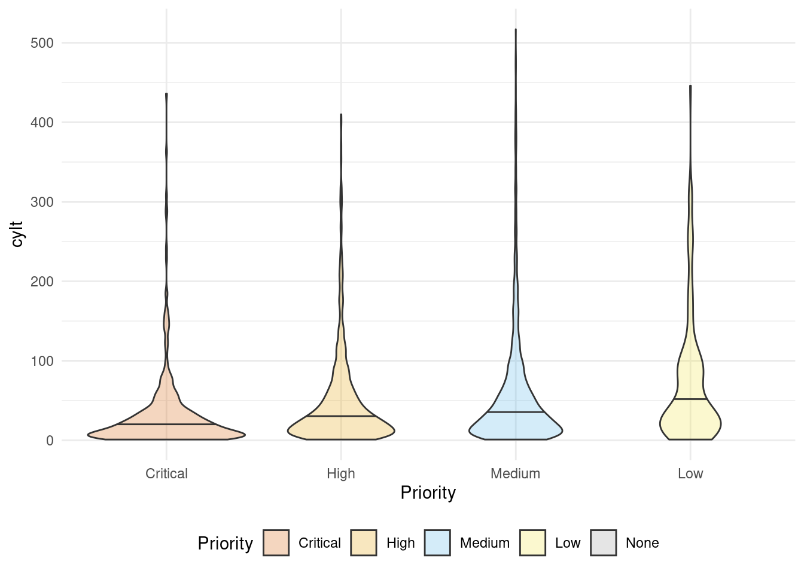
<p class="caption">(\#fig:trk-defects-fig-densdist-closed-overall)Priority based Density Distribution</p>
</div>


### Flow

#### Work in Progress (WiP)

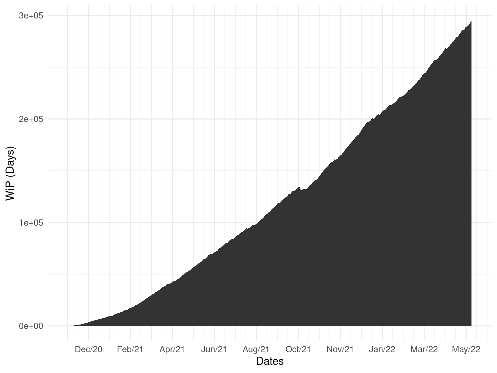

#### Inflow Outflow

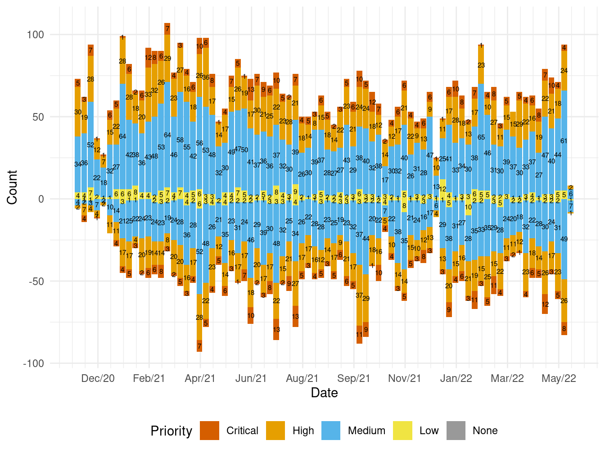

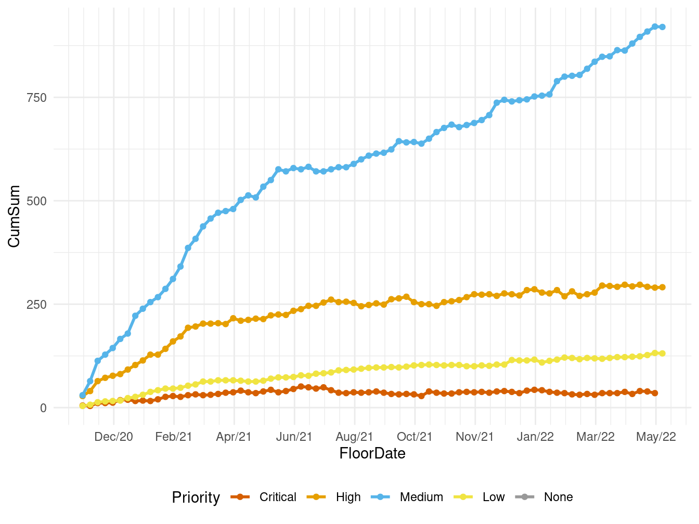


```{=html}
<div id="htmlwidget-a8003e6de69cd8ce4484" style="width:100%;height:auto;" class="datatables html-widget"></div>
<script type="application/json" data-for="htmlwidget-a8003e6de69cd8ce4484">{"x":{"filter":"top","vertical":false,"filterHTML":"<tr>\n  <td><\/td>\n  <td data-type=\"date\" style=\"vertical-align: top;\">\n    <div class=\"form-group has-feedback\" style=\"margin-bottom: auto;\">\n      <input type=\"search\" placeholder=\"All\" class=\"form-control\" style=\"width: 100%;\"/>\n      <span class=\"glyphicon glyphicon-remove-circle form-control-feedback\"><\/span>\n    <\/div>\n    <div style=\"display: none;position: absolute;width: 200px;opacity: 1\">\n      <div data-min=\"1.606608e+12\" data-max=\"1653177600000\"><\/div>\n      <span style=\"float: left;\"><\/span>\n      <span style=\"float: right;\"><\/span>\n    <\/div>\n  <\/td>\n  <td data-type=\"factor\" style=\"vertical-align: top;\">\n    <div class=\"form-group has-feedback\" style=\"margin-bottom: auto;\">\n      <input type=\"search\" placeholder=\"All\" class=\"form-control\" style=\"width: 100%;\"/>\n      <span class=\"glyphicon glyphicon-remove-circle form-control-feedback\"><\/span>\n    <\/div>\n    <div style=\"width: 100%; display: none;\">\n      <select multiple=\"multiple\" style=\"width: 100%;\" data-options=\"[&quot;Critical&quot;,&quot;High&quot;,&quot;Medium&quot;,&quot;Low&quot;,&quot;None&quot;]\"><\/select>\n    <\/div>\n  <\/td>\n  <td data-type=\"number\" style=\"vertical-align: top;\">\n    <div class=\"form-group has-feedback\" style=\"margin-bottom: auto;\">\n      <input type=\"search\" placeholder=\"All\" class=\"form-control\" style=\"width: 100%;\"/>\n      <span class=\"glyphicon glyphicon-remove-circle form-control-feedback\"><\/span>\n    <\/div>\n    <div style=\"display: none;position: absolute;width: 200px;opacity: 1\">\n      <div data-min=\"0\" data-max=\"65\"><\/div>\n      <span style=\"float: left;\"><\/span>\n      <span style=\"float: right;\"><\/span>\n    <\/div>\n  <\/td>\n  <td data-type=\"number\" style=\"vertical-align: top;\">\n    <div class=\"form-group has-feedback\" style=\"margin-bottom: auto;\">\n      <input type=\"search\" placeholder=\"All\" class=\"form-control\" style=\"width: 100%;\"/>\n      <span class=\"glyphicon glyphicon-remove-circle form-control-feedback\"><\/span>\n    <\/div>\n    <div style=\"display: none;position: absolute;width: 200px;opacity: 1\">\n      <div data-min=\"0\" data-max=\"52\"><\/div>\n      <span style=\"float: left;\"><\/span>\n      <span style=\"float: right;\"><\/span>\n    <\/div>\n  <\/td>\n  <td data-type=\"number\" style=\"vertical-align: top;\">\n    <div class=\"form-group has-feedback\" style=\"margin-bottom: auto;\">\n      <input type=\"search\" placeholder=\"All\" class=\"form-control\" style=\"width: 100%;\"/>\n      <span class=\"glyphicon glyphicon-remove-circle form-control-feedback\"><\/span>\n    <\/div>\n    <div style=\"display: none;position: absolute;width: 200px;opacity: 1\">\n      <div data-min=\"4\" data-max=\"921\"><\/div>\n      <span style=\"float: left;\"><\/span>\n      <span style=\"float: right;\"><\/span>\n    <\/div>\n  <\/td>\n<\/tr>","data":[["1","2","3","4","5","6","7","8","9","10","11","12","13","14","15","16","17","18","19","20","21","22","23","24","25","26","27","28","29","30","31","32","33","34","35","36","37","38","39","40","41","42","43","44","45","46","47","48","49","50","51","52","53","54","55","56","57","58","59","60","61","62","63","64","65","66","67","68","69","70","71","72","73","74","75","76","77","78","79","80","81","82","83","84","85","86","87","88","89","90","91","92","93","94","95","96","97","98","99","100","101","102","103","104","105","106","107","108","109","110","111","112","113","114","115","116","117","118","119","120","121","122","123","124","125","126","127","128","129","130","131","132","133","134","135","136","137","138","139","140","141","142","143","144","145","146","147","148","149","150","151","152","153","154","155","156","157","158","159","160","161","162","163","164","165","166","167","168","169","170","171","172","173","174","175","176","177","178","179","180","181","182","183","184","185","186","187","188","189","190","191","192","193","194","195","196","197","198","199","200","201","202","203","204","205","206","207","208","209","210","211","212","213","214","215","216","217","218","219","220","221","222","223","224","225","226","227","228","229","230","231","232","233","234","235","236","237","238","239","240","241","242","243","244","245","246","247","248","249","250","251","252","253","254","255","256","257","258","259","260","261","262","263","264","265","266","267","268","269","270","271","272","273","274","275","276","277","278","279","280","281","282","283","284","285","286","287","288","289","290","291","292","293","294","295","296","297","298","299","300","301","302","303","304","305","306","307","308","309","310","311"],["2020-11-29","2020-11-29","2020-11-29","2020-11-29","2020-12-06","2020-12-06","2020-12-06","2020-12-06","2020-12-13","2020-12-13","2020-12-13","2020-12-13","2020-12-20","2020-12-20","2020-12-20","2020-12-20","2020-12-27","2020-12-27","2020-12-27","2020-12-27","2021-01-03","2021-01-03","2021-01-03","2021-01-03","2021-01-10","2021-01-10","2021-01-10","2021-01-10","2021-01-17","2021-01-17","2021-01-17","2021-01-17","2021-01-24","2021-01-24","2021-01-24","2021-01-24","2021-01-31","2021-01-31","2021-01-31","2021-01-31","2021-02-07","2021-02-07","2021-02-07","2021-02-07","2021-02-14","2021-02-14","2021-02-14","2021-02-14","2021-02-21","2021-02-21","2021-02-21","2021-02-21","2021-02-28","2021-02-28","2021-02-28","2021-02-28","2021-03-07","2021-03-07","2021-03-07","2021-03-07","2021-03-14","2021-03-14","2021-03-14","2021-03-14","2021-03-21","2021-03-21","2021-03-21","2021-03-21","2021-03-28","2021-03-28","2021-03-28","2021-03-28","2021-04-04","2021-04-04","2021-04-04","2021-04-04","2021-04-11","2021-04-11","2021-04-11","2021-04-11","2021-04-18","2021-04-18","2021-04-18","2021-04-18","2021-04-25","2021-04-25","2021-04-25","2021-04-25","2021-05-02","2021-05-02","2021-05-02","2021-05-02","2021-05-09","2021-05-09","2021-05-09","2021-05-09","2021-05-16","2021-05-16","2021-05-16","2021-05-16","2021-05-23","2021-05-23","2021-05-23","2021-05-23","2021-05-30","2021-05-30","2021-05-30","2021-05-30","2021-06-06","2021-06-06","2021-06-06","2021-06-06","2021-06-13","2021-06-13","2021-06-13","2021-06-13","2021-06-20","2021-06-20","2021-06-20","2021-06-20","2021-06-27","2021-06-27","2021-06-27","2021-06-27","2021-07-04","2021-07-04","2021-07-04","2021-07-04","2021-07-11","2021-07-11","2021-07-11","2021-07-11","2021-07-18","2021-07-18","2021-07-18","2021-07-18","2021-07-25","2021-07-25","2021-07-25","2021-07-25","2021-08-01","2021-08-01","2021-08-01","2021-08-01","2021-08-08","2021-08-08","2021-08-08","2021-08-08","2021-08-15","2021-08-15","2021-08-15","2021-08-15","2021-08-22","2021-08-22","2021-08-22","2021-08-22","2021-08-29","2021-08-29","2021-08-29","2021-08-29","2021-09-05","2021-09-05","2021-09-05","2021-09-05","2021-09-12","2021-09-12","2021-09-12","2021-09-12","2021-09-19","2021-09-19","2021-09-19","2021-09-19","2021-09-26","2021-09-26","2021-09-26","2021-09-26","2021-10-03","2021-10-03","2021-10-03","2021-10-03","2021-10-10","2021-10-10","2021-10-10","2021-10-10","2021-10-17","2021-10-17","2021-10-17","2021-10-17","2021-10-24","2021-10-24","2021-10-24","2021-10-24","2021-10-31","2021-10-31","2021-10-31","2021-10-31","2021-11-07","2021-11-07","2021-11-07","2021-11-07","2021-11-14","2021-11-14","2021-11-14","2021-11-14","2021-11-21","2021-11-21","2021-11-21","2021-11-21","2021-11-28","2021-11-28","2021-11-28","2021-11-28","2021-12-05","2021-12-05","2021-12-05","2021-12-05","2021-12-12","2021-12-12","2021-12-12","2021-12-12","2021-12-19","2021-12-19","2021-12-19","2021-12-19","2021-12-26","2021-12-26","2021-12-26","2021-12-26","2022-01-02","2022-01-02","2022-01-02","2022-01-02","2022-01-09","2022-01-09","2022-01-09","2022-01-09","2022-01-16","2022-01-16","2022-01-16","2022-01-16","2022-01-23","2022-01-23","2022-01-23","2022-01-23","2022-01-30","2022-01-30","2022-01-30","2022-01-30","2022-02-06","2022-02-06","2022-02-06","2022-02-06","2022-02-13","2022-02-13","2022-02-13","2022-02-13","2022-02-20","2022-02-20","2022-02-20","2022-02-20","2022-02-27","2022-02-27","2022-02-27","2022-02-27","2022-03-06","2022-03-06","2022-03-06","2022-03-06","2022-03-13","2022-03-13","2022-03-13","2022-03-13","2022-03-20","2022-03-20","2022-03-20","2022-03-20","2022-03-27","2022-03-27","2022-03-27","2022-03-27","2022-04-03","2022-04-03","2022-04-03","2022-04-03","2022-04-10","2022-04-10","2022-04-10","2022-04-10","2022-04-17","2022-04-17","2022-04-17","2022-04-17","2022-04-24","2022-04-24","2022-04-24","2022-04-24","2022-05-01","2022-05-01","2022-05-01","2022-05-01","2022-05-08","2022-05-08","2022-05-08","2022-05-08","2022-05-15","2022-05-15","2022-05-15","2022-05-15","2022-05-22","2022-05-22","2022-05-22"],["Critical","High","Medium","Low","Critical","High","Medium","Low","Critical","High","Medium","Low","Critical","High","Medium","Low","Critical","High","Medium","Low","Critical","High","Medium","Low","Critical","High","Medium","Low","Critical","High","Medium","Low","Critical","High","Medium","Low","Critical","High","Medium","Low","Critical","High","Medium","Low","Critical","High","Medium","Low","Critical","High","Medium","Low","Critical","High","Medium","Low","Critical","High","Medium","Low","Critical","High","Medium","Low","Critical","High","Medium","Low","Critical","High","Medium","Low","Critical","High","Medium","Low","Critical","High","Medium","Low","Critical","High","Medium","Low","Critical","High","Medium","Low","Critical","High","Medium","Low","Critical","High","Medium","Low","Critical","High","Medium","Low","Critical","High","Medium","Low","Critical","High","Medium","Low","Critical","High","Medium","Low","Critical","High","Medium","Low","Critical","High","Medium","Low","Critical","High","Medium","Low","Critical","High","Medium","Low","Critical","High","Medium","Low","Critical","High","Medium","Low","Critical","High","Medium","Low","Critical","High","Medium","Low","Critical","High","Medium","Low","Critical","High","Medium","Low","Critical","High","Medium","Low","Critical","High","Medium","Low","Critical","High","Medium","Low","Critical","High","Medium","Low","Critical","High","Medium","Low","Critical","High","Medium","Low","Critical","High","Medium","Low","Critical","High","Medium","Low","Critical","High","Medium","Low","Critical","High","Medium","Low","Critical","High","Medium","Low","Critical","High","Medium","Low","Critical","High","Medium","Low","Critical","High","Medium","Low","Critical","High","Medium","Low","Critical","High","Medium","Low","Critical","High","Medium","Low","Critical","High","Medium","Low","Critical","High","Medium","Low","Critical","High","Medium","Low","Critical","High","Medium","Low","Critical","High","Medium","Low","Critical","High","Medium","Low","Critical","High","Medium","Low","Critical","High","Medium","Low","Critical","High","Medium","Low","Critical","High","Medium","Low","Critical","High","Medium","Low","Critical","High","Medium","Low","Critical","High","Medium","Low","Critical","High","Medium","Low","Critical","High","Medium","Low","Critical","High","Medium","Low","Critical","High","Medium","Low","Critical","High","Medium","Low","Critical","High","Medium","Low","Critical","High","Medium","Low","Critical","High","Medium","Low","Critical","High","Medium","Low","High","Medium","Low"],[5,30,34,4,3,19,36,4,7,28,52,7,1,12,22,2,1,7,18,1,6,15,32,1,5,22,27,6,1,28,64,6,6,28,42,6,2,18,38,8,6,20,36,4,12,33,43,4,8,32,48,2,6,26,53,5,7,29,64,7,4,23,46,4,3,27,58,7,4,16,55,4,6,18,42,5,10,26,56,6,6,36,53,3,8,17,48,3,1,14,32,0,4,17,30,4,7,15,49,4,5,26,47,7,1,19,50,5,13,17,41,2,7,30,37,2,9,21,36,5,6,25,36,2,10,22,37,8,5,23,32,4,2,28,30,3,7,21,39,9,4,18,26,2,5,14,30,1,3,8,39,3,6,15,37,5,5,18,28,2,2,14,27,2,3,22,27,4,5,23,43,2,6,21,29,3,10,24,38,6,5,24,40,3,12,18,32,3,7,12,38,1,2,14,17,3,4,12,30,2,6,17,32,1,6,21,40,5,4,22,26,1,4,9,31,3,6,13,28,2,6,9,47,3,1,10,13,1,1,11,25,12,6,17,41,4,10,28,33,1,8,18,34,3,2,13,30,3,7,17,38,6,1,23,65,5,4,10,46,5,8,27,31,2,3,11,30,2,5,15,39,3,0,15,37,1,5,29,30,1,4,22,33,3,6,16,37,4,8,19,27,1,7,22,47,3,10,21,40,3,4,18,44,5,4,24,61,5,2,6,0],[0,2,4,0,4,7,2,1,0,4,3,1,1,4,7,0,0,2,2,0,0,11,10,0,4,11,14,0,4,17,21,3,5,17,25,1,3,4,22,1,2,20,24,0,6,19,23,0,6,14,24,2,8,14,23,3,3,8,19,2,2,20,24,1,5,20,28,0,3,16,36,4,4,17,28,2,7,28,52,6,5,22,48,3,4,23,26,4,5,12,21,2,6,14,35,4,3,16,23,2,1,17,31,2,7,17,24,2,10,18,46,2,2,20,29,1,3,17,39,1,8,17,30,3,13,22,48,3,2,15,32,3,9,21,25,1,13,27,34,4,5,17,26,1,3,17,22,0,4,16,28,1,5,12,28,3,3,14,23,1,5,17,25,2,6,9,19,3,6,21,23,3,5,17,32,1,11,37,37,3,9,29,44,2,1,18,20,2,10,16,22,2,4,5,7,4,4,10,22,1,3,14,38,1,5,14,35,8,5,15,21,1,3,10,24,1,8,12,16,3,3,13,17,0,0,4,6,1,3,13,29,1,9,20,38,5,4,15,31,1,6,16,27,1,3,21,28,10,11,19,35,2,3,15,33,2,5,25,35,0,11,15,29,3,4,22,28,5,3,11,24,0,2,11,20,2,1,12,18,2,4,23,32,1,6,18,22,2,5,14,28,1,12,26,30,2,3,17,24,2,5,23,31,2,8,26,49,0,1,7,1],[5,28,30,4,4,40,64,7,11,64,113,13,11,72,128,15,12,77,144,16,18,81,166,17,19,92,179,23,16,103,222,26,17,114,239,31,16,128,255,38,20,128,267,42,26,142,287,46,28,160,311,46,26,172,341,48,30,193,386,53,32,196,408,56,30,203,438,63,31,203,457,63,33,204,471,66,36,202,475,66,37,216,480,66,41,210,502,65,37,212,513,63,35,215,508,63,39,214,534,65,43,223,550,70,37,225,576,73,40,224,571,73,45,234,579,74,51,238,576,78,49,246,582,77,46,246,571,82,49,254,571,83,42,261,576,85,36,255,581,90,35,256,581,91,37,253,589,92,36,245,600,94,37,248,609,96,39,252,614,97,36,249,616,97,33,262,624,98,32,264,644,97,33,268,641,99,32,255,642,102,28,250,638,103,39,250,650,104,36,246,666,103,34,255,676,102,34,257,684,103,37,260,678,103,38,267,683,100,37,274,688,100,38,273,695,102,36,274,707,101,39,270,737,104,40,276,744,104,38,274,740,115,35,271,743,114,41,284,745,114,43,286,752,116,42,278,754,109,38,276,757,113,36,284,789,116,35,269,800,121,32,281,802,120,31,270,804,117,33,274,819,120,31,278,836,119,35,295,848,118,35,294,849,120,35,292,864,122,38,297,863,122,33,293,880,123,40,297,896,124,39,292,909,127,35,290,921,132,291,920,131]],"container":"<table class=\"display\">\n  <thead>\n    <tr>\n      <th> <\/th>\n      <th>FloorDate<\/th>\n      <th>Priority<\/th>\n      <th>Opened<\/th>\n      <th>Closed<\/th>\n      <th>CumSum<\/th>\n    <\/tr>\n  <\/thead>\n<\/table>","options":{"columnDefs":[{"className":"dt-right","targets":[3,4,5]},{"orderable":false,"targets":0}],"order":[],"autoWidth":false,"orderClasses":false,"orderCellsTop":true}},"evals":[],"jsHooks":[]}</script>
```
