# Opics


## Delivery Metrics 


###  Cycle Time


#### Summary

The below [Five-number summary](https://en.wikipedia.org/wiki/Five-number_summary) 
will provide a high level distribution of the cycle times. 
The 75% Qartile value is significant because that is the number which you can 
typically see as the turn around time (TAT) to service a work item.

<table class="table table-striped" style="width: auto !important; margin-left: auto; margin-right: auto;">
<caption>(\#tab:opics-cycle-time-summ)5 Number Summary</caption>
 <thead>
  <tr>
   <th style="text-align:left;"> Type </th>
   <th style="text-align:left;"> Priority </th>
   <th style="text-align:right;"> Count </th>
   <th style="text-align:right;"> Min </th>
   <th style="text-align:right;"> LoQ </th>
   <th style="text-align:right;"> Med </th>
   <th style="text-align:right;"> UpQ </th>
   <th style="text-align:right;"> Max </th>
  </tr>
 </thead>
<tbody>
  <tr>
   <td style="text-align:left;"> Epic </td>
   <td style="text-align:left;"> Critical </td>
   <td style="text-align:right;"> 7 </td>
   <td style="text-align:right;"> 43 </td>
   <td style="text-align:right;"> 67.0 </td>
   <td style="text-align:right;"> 86 </td>
   <td style="text-align:right;"> 87.5 </td>
   <td style="text-align:right;"> 120 </td>
  </tr>
  <tr>
   <td style="text-align:left;"> Epic </td>
   <td style="text-align:left;"> High </td>
   <td style="text-align:right;"> 13 </td>
   <td style="text-align:right;"> 1 </td>
   <td style="text-align:right;"> 87.0 </td>
   <td style="text-align:right;"> 162 </td>
   <td style="text-align:right;"> 278.0 </td>
   <td style="text-align:right;"> 466 </td>
  </tr>
  <tr>
   <td style="text-align:left;"> Epic </td>
   <td style="text-align:left;"> Medium </td>
   <td style="text-align:right;"> 19 </td>
   <td style="text-align:right;"> 12 </td>
   <td style="text-align:right;"> 71.5 </td>
   <td style="text-align:right;"> 130 </td>
   <td style="text-align:right;"> 259.0 </td>
   <td style="text-align:right;"> 443 </td>
  </tr>
  <tr>
   <td style="text-align:left;"> Story </td>
   <td style="text-align:left;"> Critical </td>
   <td style="text-align:right;"> 27 </td>
   <td style="text-align:right;"> 7 </td>
   <td style="text-align:right;"> 43.0 </td>
   <td style="text-align:right;"> 71 </td>
   <td style="text-align:right;"> 87.5 </td>
   <td style="text-align:right;"> 88 </td>
  </tr>
  <tr>
   <td style="text-align:left;"> Story </td>
   <td style="text-align:left;"> High </td>
   <td style="text-align:right;"> 472 </td>
   <td style="text-align:right;"> 1 </td>
   <td style="text-align:right;"> 18.0 </td>
   <td style="text-align:right;"> 39 </td>
   <td style="text-align:right;"> 86.0 </td>
   <td style="text-align:right;"> 352 </td>
  </tr>
  <tr>
   <td style="text-align:left;"> Story </td>
   <td style="text-align:left;"> Medium </td>
   <td style="text-align:right;"> 447 </td>
   <td style="text-align:right;"> 1 </td>
   <td style="text-align:right;"> 21.5 </td>
   <td style="text-align:right;"> 78 </td>
   <td style="text-align:right;"> 182.0 </td>
   <td style="text-align:right;"> 352 </td>
  </tr>
  <tr>
   <td style="text-align:left;"> Story </td>
   <td style="text-align:left;"> Low </td>
   <td style="text-align:right;"> 2 </td>
   <td style="text-align:right;"> 56 </td>
   <td style="text-align:right;"> 73.5 </td>
   <td style="text-align:right;"> 91 </td>
   <td style="text-align:right;"> 108.5 </td>
   <td style="text-align:right;"> 126 </td>
  </tr>
</tbody>
</table>

#### Epics


<div class="figure" style="text-align: center">
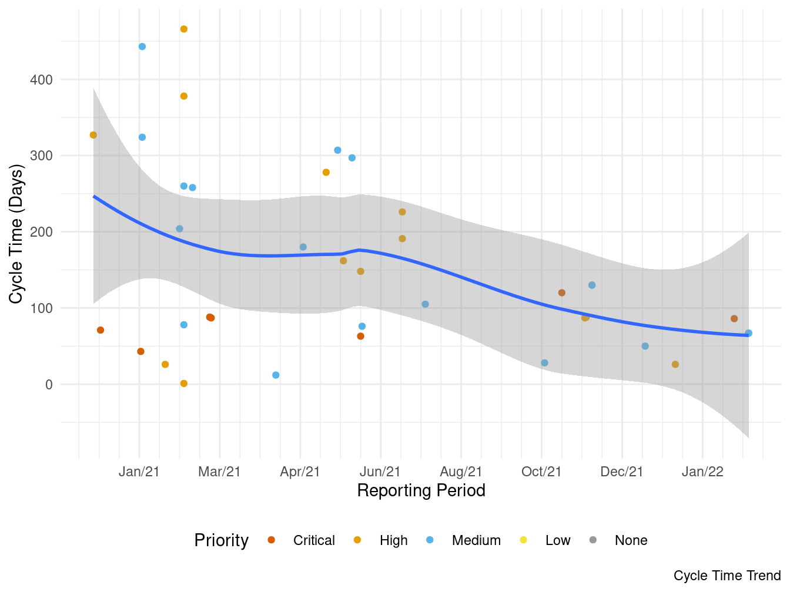
<p class="caption">(\#fig:opics-epics-cycle-time-trend-fig)Cycle Time Trend</p>
</div>


<table class="table table-striped" style="width: auto !important; margin-left: auto; margin-right: auto;">
<caption>(\#tab:opics-epics-summary-metrics)5 Number Summary</caption>
 <thead>
  <tr>
   <th style="text-align:left;"> Type </th>
   <th style="text-align:left;"> Priority </th>
   <th style="text-align:right;"> Count </th>
   <th style="text-align:right;"> Min </th>
   <th style="text-align:right;"> LoQ </th>
   <th style="text-align:right;"> Med </th>
   <th style="text-align:right;"> UpQ </th>
   <th style="text-align:right;"> Max </th>
  </tr>
 </thead>
<tbody>
  <tr>
   <td style="text-align:left;"> Epic </td>
   <td style="text-align:left;"> Critical </td>
   <td style="text-align:right;"> 7 </td>
   <td style="text-align:right;"> 43 </td>
   <td style="text-align:right;"> 67.0 </td>
   <td style="text-align:right;"> 86 </td>
   <td style="text-align:right;"> 87.5 </td>
   <td style="text-align:right;"> 120 </td>
  </tr>
  <tr>
   <td style="text-align:left;"> Epic </td>
   <td style="text-align:left;"> High </td>
   <td style="text-align:right;"> 13 </td>
   <td style="text-align:right;"> 1 </td>
   <td style="text-align:right;"> 87.0 </td>
   <td style="text-align:right;"> 162 </td>
   <td style="text-align:right;"> 278.0 </td>
   <td style="text-align:right;"> 466 </td>
  </tr>
  <tr>
   <td style="text-align:left;"> Epic </td>
   <td style="text-align:left;"> Medium </td>
   <td style="text-align:right;"> 19 </td>
   <td style="text-align:right;"> 12 </td>
   <td style="text-align:right;"> 71.5 </td>
   <td style="text-align:right;"> 130 </td>
   <td style="text-align:right;"> 259.0 </td>
   <td style="text-align:right;"> 443 </td>
  </tr>
</tbody>
</table>

#### Stories

<div class="figure" style="text-align: center">
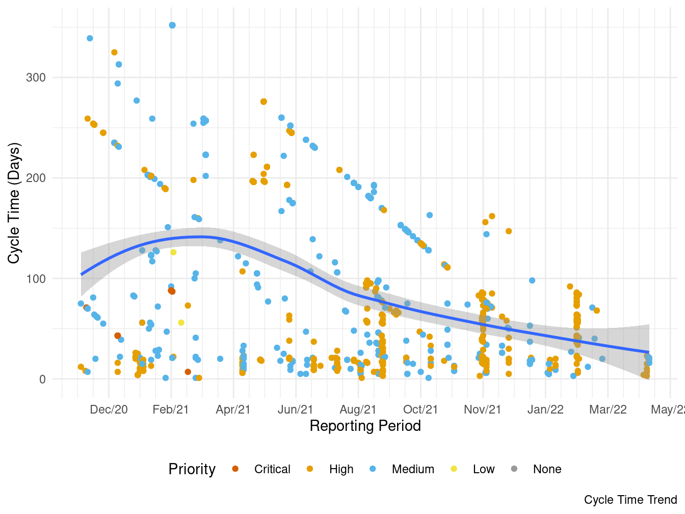
<p class="caption">(\#fig:opics-stories-cycle-time-trend-fig)Cycle Time Trend</p>
</div>


<table class="table table-striped" style="width: auto !important; margin-left: auto; margin-right: auto;">
<caption>(\#tab:opics-story-summary-metrics)5 Number Summary</caption>
 <thead>
  <tr>
   <th style="text-align:left;"> Type </th>
   <th style="text-align:left;"> Priority </th>
   <th style="text-align:right;"> Count </th>
   <th style="text-align:right;"> Min </th>
   <th style="text-align:right;"> LoQ </th>
   <th style="text-align:right;"> Med </th>
   <th style="text-align:right;"> UpQ </th>
   <th style="text-align:right;"> Max </th>
  </tr>
 </thead>
<tbody>
  <tr>
   <td style="text-align:left;"> Story </td>
   <td style="text-align:left;"> Critical </td>
   <td style="text-align:right;"> 27 </td>
   <td style="text-align:right;"> 7 </td>
   <td style="text-align:right;"> 43.0 </td>
   <td style="text-align:right;"> 71 </td>
   <td style="text-align:right;"> 87.5 </td>
   <td style="text-align:right;"> 88 </td>
  </tr>
  <tr>
   <td style="text-align:left;"> Story </td>
   <td style="text-align:left;"> High </td>
   <td style="text-align:right;"> 472 </td>
   <td style="text-align:right;"> 1 </td>
   <td style="text-align:right;"> 18.0 </td>
   <td style="text-align:right;"> 39 </td>
   <td style="text-align:right;"> 86.0 </td>
   <td style="text-align:right;"> 352 </td>
  </tr>
  <tr>
   <td style="text-align:left;"> Story </td>
   <td style="text-align:left;"> Medium </td>
   <td style="text-align:right;"> 447 </td>
   <td style="text-align:right;"> 1 </td>
   <td style="text-align:right;"> 21.5 </td>
   <td style="text-align:right;"> 78 </td>
   <td style="text-align:right;"> 182.0 </td>
   <td style="text-align:right;"> 352 </td>
  </tr>
  <tr>
   <td style="text-align:left;"> Story </td>
   <td style="text-align:left;"> Low </td>
   <td style="text-align:right;"> 2 </td>
   <td style="text-align:right;"> 56 </td>
   <td style="text-align:right;"> 73.5 </td>
   <td style="text-align:right;"> 91 </td>
   <td style="text-align:right;"> 108.5 </td>
   <td style="text-align:right;"> 126 </td>
  </tr>
</tbody>
</table>

### Throughput

#### Epics

<div class="figure" style="text-align: center">
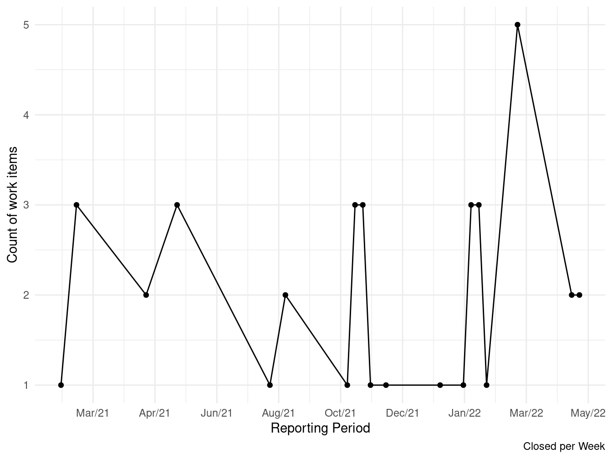
<p class="caption">(\#fig:opics-completed-epics-week-fig)Closed Epics by Week</p>
</div>

The plot below shows the number of epics closed in every week, marked separately in different color based on priority

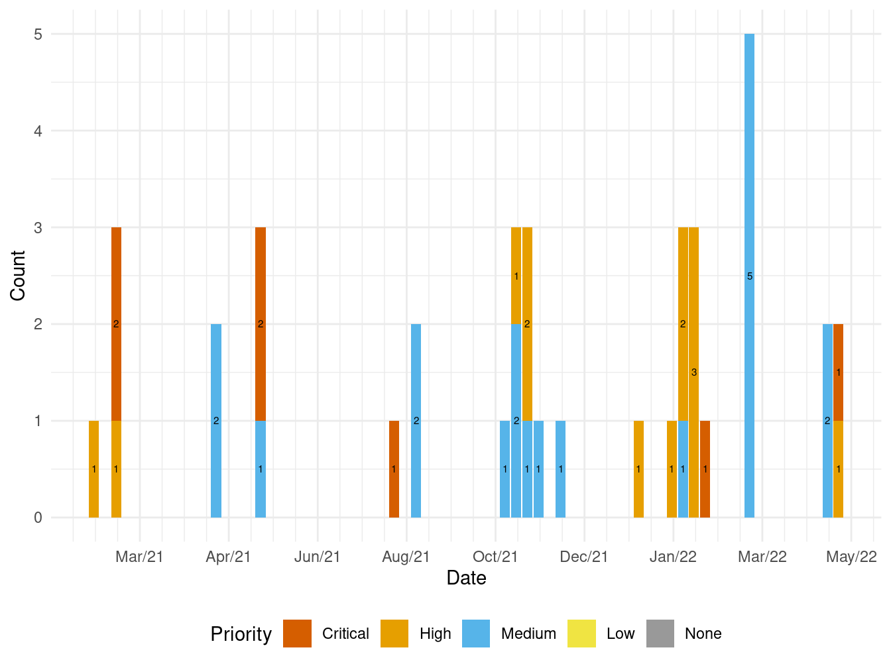


<!-- - Density distribution -->

<!-- Gives and indication of the densities especially the occurrence of multiple maxima in the data. This can be due to multiple categories of work items which may be investigated further.  -->

<!-- ```{r opics-density-distibution-closed-epics-fig, include=TRUE, echo=FALSE, out.width="80%", fig.align="center", fig.asp=.75, fig.cap="Priority based Density Distribution", message=FALSE, warning=FALSE} -->
<!-- epics.closed %>% violin_plot.CycleTimeVsPriority() -->
<!-- ``` -->


#### Stories


Tells us the number of work items (stories) completed aggregated for each 
week which is an indication of how stable the throughput is.

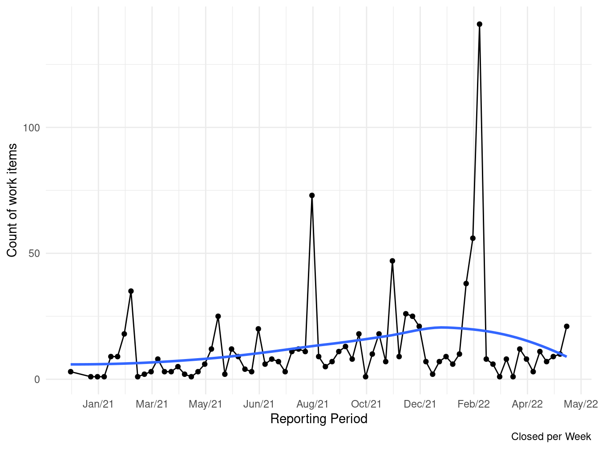

The plot below shows the number of stories closed in every week, marked separately in different color based on priority


<div class="figure" style="text-align: center">
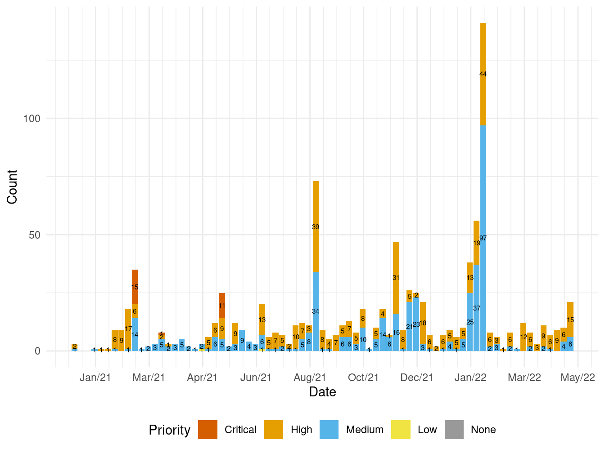
<p class="caption">(\#fig:opics-stories-wk-agg-fig)Number of Stories Closed in a Week colored by Priority</p>
</div>

- Density distribution

Gives and indication of the densities especially the occurrence of multiple maxima in the data. This can be due to multiple categories of work items which may be investigated further. 

<div class="figure" style="text-align: center">
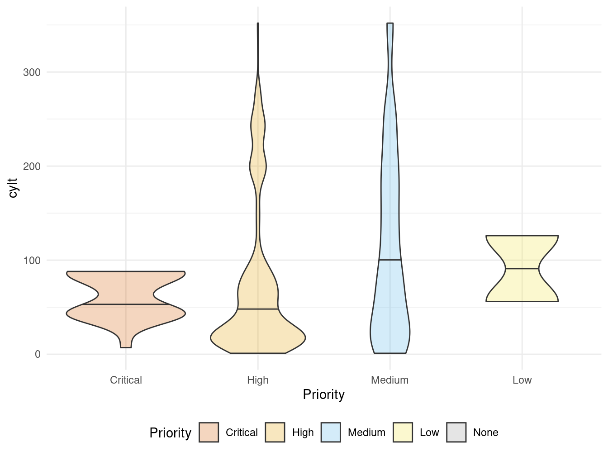
<p class="caption">(\#fig:opics-density-distibution-closed-stories-fig)Priority based Density Distribution</p>
</div>


### Flow

#### Work in Progress (WiP)

##### Epics 


<div class="figure" style="text-align: center">

<p class="caption">(\#fig:opics-epics-work-in-progress-fig )WiP in Days</p>
</div>

##### Stories


<div class="figure" style="text-align: center">

<p class="caption">(\#fig:opics-stories-work-in-progress-fig )WiP in Days</p>
</div>

#### Inflow/OutFlow

##### Epics

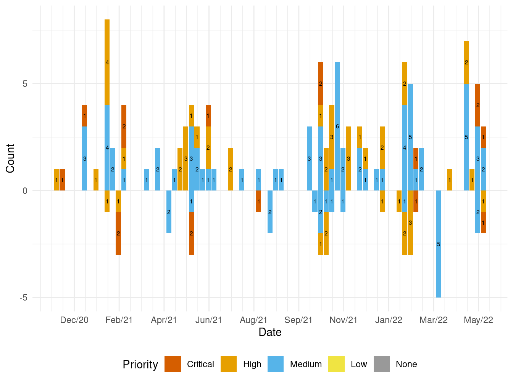

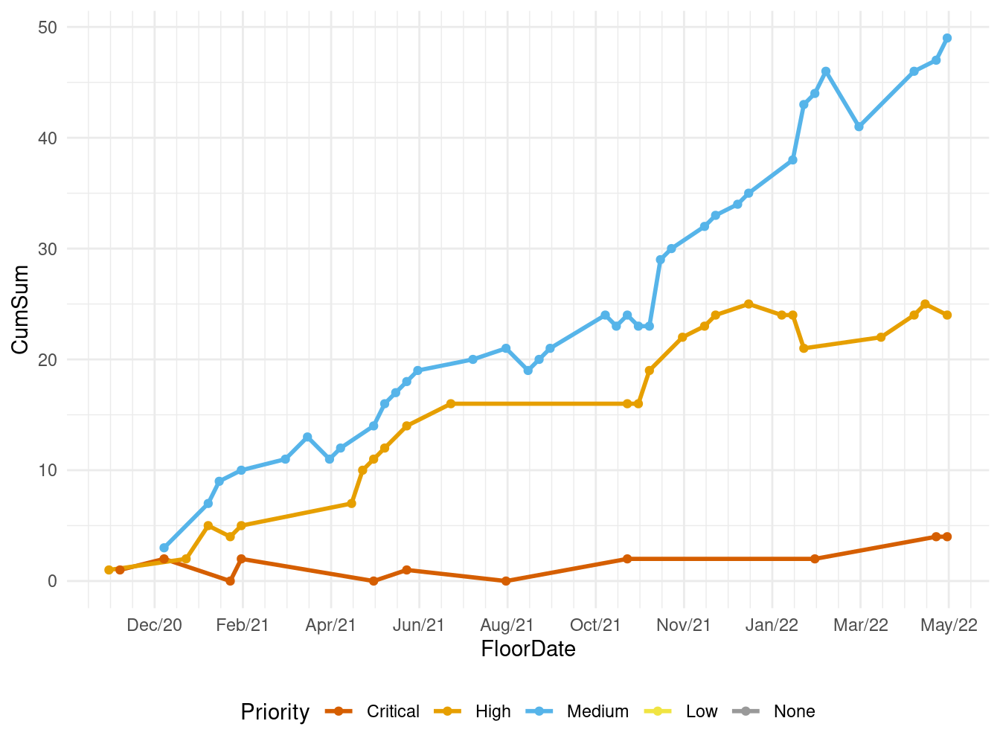


```{=html}
<style type="text/css">
.plot-fill { width: 80%; height: 100%; }
.center {
                          display: block; 
                          margin-left: auto; 
                          margin-right: auto;
                        }
#left_plt { float: left; background-color: #ccffcc;  }
#right_plt { float: right; background-color: #ccffcc; }
#center_plt { float: center; background-color: #ccffcc; }
</style>
<div id="center_plt" class="plot-fill center">
<div id="htmlwidget-4bbf7ca2968ac0cd72d3" style="width:100%;height:400px;" class="plotly html-widget"></div>
<script type="application/json" data-for="htmlwidget-4bbf7ca2968ac0cd72d3">{"x":{"visdat":{"973a458d9e":["function () ","plotlyVisDat"]},"cur_data":"973a458d9e","attrs":{"973a458d9e":{"x":{},"y":{},"mode":"lines+markers","color":{},"colors":["#D55E00","#E69F00","#56B4E9","#F0E442","#999999"],"alpha_stroke":1,"sizes":[10,100],"spans":[1,20],"type":"scatter"}},"layout":{"margin":{"b":40,"l":60,"t":25,"r":10},"legend":{"orientation":"h","xanchor":"center","x":0.5,"y":-0.2},"xaxis":{"domain":[0,1],"automargin":true,"title":"FloorDate"},"yaxis":{"domain":[0,1],"automargin":true,"title":"CumSum"},"hovermode":"closest","showlegend":true},"source":"A","config":{"modeBarButtonsToAdd":["hoverclosest","hovercompare"],"showSendToCloud":false,"displaylogo":false,"modeBarButtonsToRemove":["zoomIn2d","zoomOut2d"]},"data":[{"x":["2021-01-03","2021-01-31","2021-02-07","2021-02-21","2021-03-21","2021-04-04","2021-04-18","2021-04-25","2021-05-16","2021-05-23","2021-05-30","2021-06-06","2021-06-13","2021-07-18","2021-08-08","2021-08-22","2021-08-29","2021-09-05","2021-10-10","2021-10-17","2021-10-24","2021-10-31","2021-11-07","2021-11-14","2021-11-21","2021-12-12","2021-12-19","2022-01-02","2022-01-09","2022-02-06","2022-02-13","2022-02-20","2022-02-27","2022-03-20","2022-04-24","2022-05-08","2022-05-15"],"y":[3,7,9,10,11,13,11,12,14,16,17,18,19,20,21,19,20,21,24,23,24,23,23,29,30,32,33,34,35,38,43,44,46,41,46,47,49],"mode":"lines+markers","type":"scatter","name":"Medium","marker":{"color":"rgba(86,180,233,1)","line":{"color":"rgba(86,180,233,1)"}},"textfont":{"color":"rgba(86,180,233,1)"},"error_y":{"color":"rgba(86,180,233,1)"},"error_x":{"color":"rgba(86,180,233,1)"},"line":{"color":"rgba(86,180,233,1)"},"xaxis":"x","yaxis":"y","frame":null},{"x":["2020-11-29","2021-01-17","2021-01-31","2021-02-14","2021-02-21","2021-05-02","2021-05-09","2021-05-16","2021-05-23","2021-06-06","2021-07-04","2021-10-24","2021-10-31","2021-11-07","2021-11-28","2021-12-12","2021-12-19","2022-01-09","2022-01-30","2022-02-06","2022-02-13","2022-04-03","2022-04-24","2022-05-01","2022-05-15"],"y":[1,2,5,4,5,7,10,11,12,14,16,16,16,19,22,23,24,25,24,24,21,22,24,25,24],"mode":"lines+markers","type":"scatter","name":"High","marker":{"color":"rgba(230,159,0,1)","line":{"color":"rgba(230,159,0,1)"}},"textfont":{"color":"rgba(230,159,0,1)"},"error_y":{"color":"rgba(230,159,0,1)"},"error_x":{"color":"rgba(230,159,0,1)"},"line":{"color":"rgba(230,159,0,1)"},"xaxis":"x","yaxis":"y","frame":null},{"x":["2020-12-06","2021-01-03","2021-02-14","2021-02-21","2021-05-16","2021-06-06","2021-08-08","2021-10-24","2022-02-20","2022-05-08","2022-05-15"],"y":[1,2,0,2,0,1,0,2,2,4,4],"mode":"lines+markers","type":"scatter","name":"Critical","marker":{"color":"rgba(213,94,0,1)","line":{"color":"rgba(213,94,0,1)"}},"textfont":{"color":"rgba(213,94,0,1)"},"error_y":{"color":"rgba(213,94,0,1)"},"error_x":{"color":"rgba(213,94,0,1)"},"line":{"color":"rgba(213,94,0,1)"},"xaxis":"x","yaxis":"y","frame":null}],"highlight":{"on":"plotly_click","persistent":false,"dynamic":false,"selectize":false,"opacityDim":0.2,"selected":{"opacity":1},"debounce":0},"shinyEvents":["plotly_hover","plotly_click","plotly_selected","plotly_relayout","plotly_brushed","plotly_brushing","plotly_clickannotation","plotly_doubleclick","plotly_deselect","plotly_afterplot","plotly_sunburstclick"],"base_url":"https://plot.ly"},"evals":[],"jsHooks":[]}</script>
</div>
```


```{=html}
<div id="htmlwidget-a3ef79786cd63b90a1fb" style="width:100%;height:auto;" class="datatables html-widget"></div>
<script type="application/json" data-for="htmlwidget-a3ef79786cd63b90a1fb">{"x":{"filter":"top","vertical":false,"filterHTML":"<tr>\n  <td><\/td>\n  <td data-type=\"date\" style=\"vertical-align: top;\">\n    <div class=\"form-group has-feedback\" style=\"margin-bottom: auto;\">\n      <input type=\"search\" placeholder=\"All\" class=\"form-control\" style=\"width: 100%;\"/>\n      <span class=\"glyphicon glyphicon-remove-circle form-control-feedback\"><\/span>\n    <\/div>\n    <div style=\"display: none;position: absolute;width: 200px;opacity: 1\">\n      <div data-min=\"1.606608e+12\" data-max=\"1652572800000\"><\/div>\n      <span style=\"float: left;\"><\/span>\n      <span style=\"float: right;\"><\/span>\n    <\/div>\n  <\/td>\n  <td data-type=\"factor\" style=\"vertical-align: top;\">\n    <div class=\"form-group has-feedback\" style=\"margin-bottom: auto;\">\n      <input type=\"search\" placeholder=\"All\" class=\"form-control\" style=\"width: 100%;\"/>\n      <span class=\"glyphicon glyphicon-remove-circle form-control-feedback\"><\/span>\n    <\/div>\n    <div style=\"width: 100%; display: none;\">\n      <select multiple=\"multiple\" style=\"width: 100%;\" data-options=\"[&quot;Critical&quot;,&quot;High&quot;,&quot;Medium&quot;,&quot;Low&quot;,&quot;None&quot;]\"><\/select>\n    <\/div>\n  <\/td>\n  <td data-type=\"number\" style=\"vertical-align: top;\">\n    <div class=\"form-group has-feedback\" style=\"margin-bottom: auto;\">\n      <input type=\"search\" placeholder=\"All\" class=\"form-control\" style=\"width: 100%;\"/>\n      <span class=\"glyphicon glyphicon-remove-circle form-control-feedback\"><\/span>\n    <\/div>\n    <div style=\"display: none;position: absolute;width: 200px;opacity: 1\">\n      <div data-min=\"0\" data-max=\"6\"><\/div>\n      <span style=\"float: left;\"><\/span>\n      <span style=\"float: right;\"><\/span>\n    <\/div>\n  <\/td>\n  <td data-type=\"number\" style=\"vertical-align: top;\">\n    <div class=\"form-group has-feedback\" style=\"margin-bottom: auto;\">\n      <input type=\"search\" placeholder=\"All\" class=\"form-control\" style=\"width: 100%;\"/>\n      <span class=\"glyphicon glyphicon-remove-circle form-control-feedback\"><\/span>\n    <\/div>\n    <div style=\"display: none;position: absolute;width: 200px;opacity: 1\">\n      <div data-min=\"0\" data-max=\"5\"><\/div>\n      <span style=\"float: left;\"><\/span>\n      <span style=\"float: right;\"><\/span>\n    <\/div>\n  <\/td>\n  <td data-type=\"number\" style=\"vertical-align: top;\">\n    <div class=\"form-group has-feedback\" style=\"margin-bottom: auto;\">\n      <input type=\"search\" placeholder=\"All\" class=\"form-control\" style=\"width: 100%;\"/>\n      <span class=\"glyphicon glyphicon-remove-circle form-control-feedback\"><\/span>\n    <\/div>\n    <div style=\"display: none;position: absolute;width: 200px;opacity: 1\">\n      <div data-min=\"0\" data-max=\"49\"><\/div>\n      <span style=\"float: left;\"><\/span>\n      <span style=\"float: right;\"><\/span>\n    <\/div>\n  <\/td>\n<\/tr>","data":[["1","2","3","4","5","6","7","8","9","10","11","12","13","14","15","16","17","18","19","20","21","22","23","24","25","26","27","28","29","30","31","32","33","34","35","36","37","38","39","40","41","42","43","44","45","46","47","48","49","50","51","52","53","54","55","56","57","58","59","60","61","62","63","64","65","66","67","68","69","70","71","72","73"],["2020-11-29","2020-12-06","2021-01-03","2021-01-03","2021-01-17","2021-01-31","2021-01-31","2021-02-07","2021-02-14","2021-02-14","2021-02-21","2021-02-21","2021-02-21","2021-03-21","2021-04-04","2021-04-18","2021-04-25","2021-05-02","2021-05-09","2021-05-16","2021-05-16","2021-05-16","2021-05-23","2021-05-23","2021-05-30","2021-06-06","2021-06-06","2021-06-06","2021-06-13","2021-07-04","2021-07-18","2021-08-08","2021-08-08","2021-08-22","2021-08-29","2021-09-05","2021-10-10","2021-10-17","2021-10-24","2021-10-24","2021-10-24","2021-10-31","2021-10-31","2021-11-07","2021-11-07","2021-11-14","2021-11-21","2021-11-28","2021-12-12","2021-12-12","2021-12-19","2021-12-19","2022-01-02","2022-01-09","2022-01-09","2022-01-30","2022-02-06","2022-02-06","2022-02-13","2022-02-13","2022-02-20","2022-02-20","2022-02-27","2022-03-20","2022-04-03","2022-04-24","2022-04-24","2022-05-01","2022-05-08","2022-05-08","2022-05-15","2022-05-15","2022-05-15"],["High","Critical","Critical","Medium","High","High","Medium","Medium","Critical","High","Critical","High","Medium","Medium","Medium","Medium","Medium","High","High","Critical","High","Medium","High","Medium","Medium","Critical","High","Medium","Medium","High","Medium","Critical","Medium","Medium","Medium","Medium","Medium","Medium","Critical","High","Medium","High","Medium","High","Medium","Medium","Medium","High","High","Medium","High","Medium","Medium","High","Medium","High","High","Medium","High","Medium","Critical","Medium","Medium","Medium","High","High","Medium","High","Critical","Medium","Critical","High","Medium"],[1,1,1,3,1,4,4,2,0,0,2,1,1,1,2,0,1,2,3,0,1,3,1,2,1,1,2,1,1,2,1,0,1,0,1,1,3,0,2,1,3,2,0,3,1,6,2,3,1,2,1,1,1,2,1,0,2,4,0,5,1,1,2,0,1,2,5,1,2,3,1,0,2],[0,0,0,0,0,1,0,0,2,1,0,0,0,0,0,2,0,0,0,2,0,1,0,0,0,0,0,0,0,0,0,1,0,2,0,0,0,1,0,1,2,2,1,0,1,0,1,0,0,0,0,0,0,1,0,1,2,1,3,0,1,0,0,5,0,0,0,0,0,2,1,1,0],[1,1,2,3,2,5,7,9,0,4,2,5,10,11,13,11,12,7,10,0,11,14,12,16,17,1,14,18,19,16,20,0,21,19,20,21,24,23,2,16,24,16,23,19,23,29,30,22,23,32,24,33,34,25,35,24,24,38,21,43,2,44,46,41,22,24,46,25,4,47,4,24,49]],"container":"<table class=\"display\">\n  <thead>\n    <tr>\n      <th> <\/th>\n      <th>FloorDate<\/th>\n      <th>Priority<\/th>\n      <th>Opened<\/th>\n      <th>Closed<\/th>\n      <th>CumSum<\/th>\n    <\/tr>\n  <\/thead>\n<\/table>","options":{"columnDefs":[{"className":"dt-right","targets":[3,4,5]},{"orderable":false,"targets":0}],"order":[],"autoWidth":false,"orderClasses":false,"orderCellsTop":true}},"evals":[],"jsHooks":[]}</script>
```
##### Stories

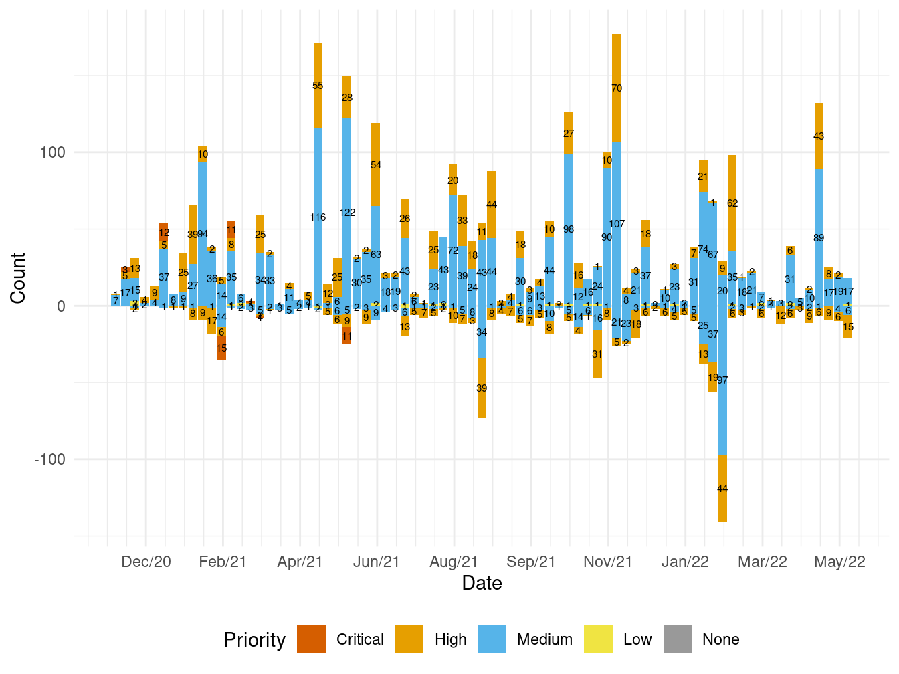

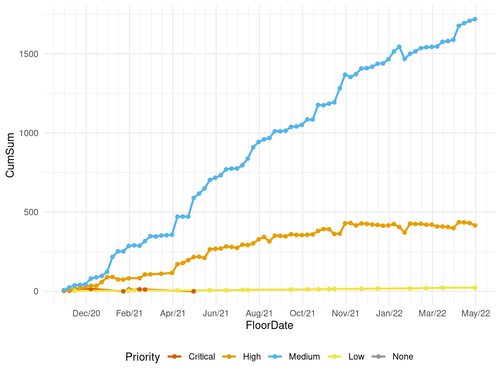

## Defect Metrics


###  Cycle Time

Below is the [5 Number Summary](https://en.wikipedia.org/wiki/Five-number_summary) 
of the entire data set. The 75% Qartile value is significant because that is the 
number which you can typically see as the turn around time (TAT) to service a defect.

#### Summary

<table class="table table-striped" style="width: auto !important; margin-left: auto; margin-right: auto;">
<caption>(\#tab:opics-defects-tab-cycle-time-basic-stats)5 Number Summary</caption>
 <thead>
  <tr>
   <th style="text-align:right;"> Min </th>
   <th style="text-align:right;"> LoQ </th>
   <th style="text-align:right;"> Med </th>
   <th style="text-align:right;"> UpQ </th>
   <th style="text-align:right;"> Max </th>
  </tr>
 </thead>
<tbody>
  <tr>
   <td style="text-align:right;"> 1 </td>
   <td style="text-align:right;"> 7 </td>
   <td style="text-align:right;"> 27 </td>
   <td style="text-align:right;"> 58 </td>
   <td style="text-align:right;"> 486 </td>
  </tr>
</tbody>
</table>


#### Cycle Time Trend

This reflects the capacity/capability of the team to resolve across all 
priorities as indicated by a trend.

<div class="figure" style="text-align: center">
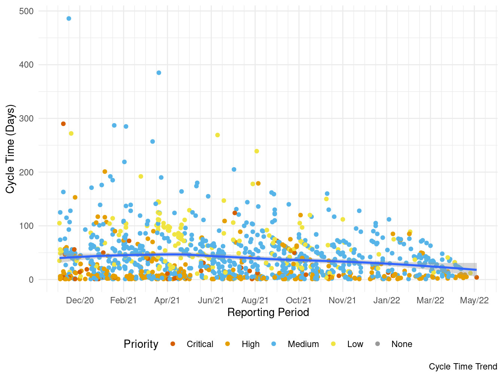
<p class="caption">(\#fig:opics-defects-cycle-time-trend-all)All Severities</p>
</div>


#### 5 Number Summary

<table class="table table-striped" style="width: auto !important; margin-left: auto; margin-right: auto;">
<caption>(\#tab:opics-defects-cycle-time-summary)All Severities</caption>
 <thead>
  <tr>
   <th style="text-align:left;"> Type </th>
   <th style="text-align:left;"> Priority </th>
   <th style="text-align:right;"> Count </th>
   <th style="text-align:right;"> Min </th>
   <th style="text-align:right;"> LoQ </th>
   <th style="text-align:right;"> Med </th>
   <th style="text-align:right;"> UpQ </th>
   <th style="text-align:right;"> Max </th>
  </tr>
 </thead>
<tbody>
  <tr>
   <td style="text-align:left;"> Epic </td>
   <td style="text-align:left;"> Critical </td>
   <td style="text-align:right;"> 7 </td>
   <td style="text-align:right;"> 43 </td>
   <td style="text-align:right;"> 67.0 </td>
   <td style="text-align:right;"> 86 </td>
   <td style="text-align:right;"> 87.5 </td>
   <td style="text-align:right;"> 120 </td>
  </tr>
  <tr>
   <td style="text-align:left;"> Epic </td>
   <td style="text-align:left;"> High </td>
   <td style="text-align:right;"> 13 </td>
   <td style="text-align:right;"> 1 </td>
   <td style="text-align:right;"> 87.0 </td>
   <td style="text-align:right;"> 162 </td>
   <td style="text-align:right;"> 278.0 </td>
   <td style="text-align:right;"> 466 </td>
  </tr>
  <tr>
   <td style="text-align:left;"> Epic </td>
   <td style="text-align:left;"> Medium </td>
   <td style="text-align:right;"> 19 </td>
   <td style="text-align:right;"> 12 </td>
   <td style="text-align:right;"> 71.5 </td>
   <td style="text-align:right;"> 130 </td>
   <td style="text-align:right;"> 259.0 </td>
   <td style="text-align:right;"> 443 </td>
  </tr>
  <tr>
   <td style="text-align:left;"> Story </td>
   <td style="text-align:left;"> Critical </td>
   <td style="text-align:right;"> 27 </td>
   <td style="text-align:right;"> 7 </td>
   <td style="text-align:right;"> 43.0 </td>
   <td style="text-align:right;"> 71 </td>
   <td style="text-align:right;"> 87.5 </td>
   <td style="text-align:right;"> 88 </td>
  </tr>
  <tr>
   <td style="text-align:left;"> Story </td>
   <td style="text-align:left;"> High </td>
   <td style="text-align:right;"> 472 </td>
   <td style="text-align:right;"> 1 </td>
   <td style="text-align:right;"> 18.0 </td>
   <td style="text-align:right;"> 39 </td>
   <td style="text-align:right;"> 86.0 </td>
   <td style="text-align:right;"> 352 </td>
  </tr>
  <tr>
   <td style="text-align:left;"> Story </td>
   <td style="text-align:left;"> Medium </td>
   <td style="text-align:right;"> 447 </td>
   <td style="text-align:right;"> 1 </td>
   <td style="text-align:right;"> 21.5 </td>
   <td style="text-align:right;"> 78 </td>
   <td style="text-align:right;"> 182.0 </td>
   <td style="text-align:right;"> 352 </td>
  </tr>
  <tr>
   <td style="text-align:left;"> Story </td>
   <td style="text-align:left;"> Low </td>
   <td style="text-align:right;"> 2 </td>
   <td style="text-align:right;"> 56 </td>
   <td style="text-align:right;"> 73.5 </td>
   <td style="text-align:right;"> 91 </td>
   <td style="text-align:right;"> 108.5 </td>
   <td style="text-align:right;"> 126 </td>
  </tr>
</tbody>
</table>

<div class="figure" style="text-align: center">
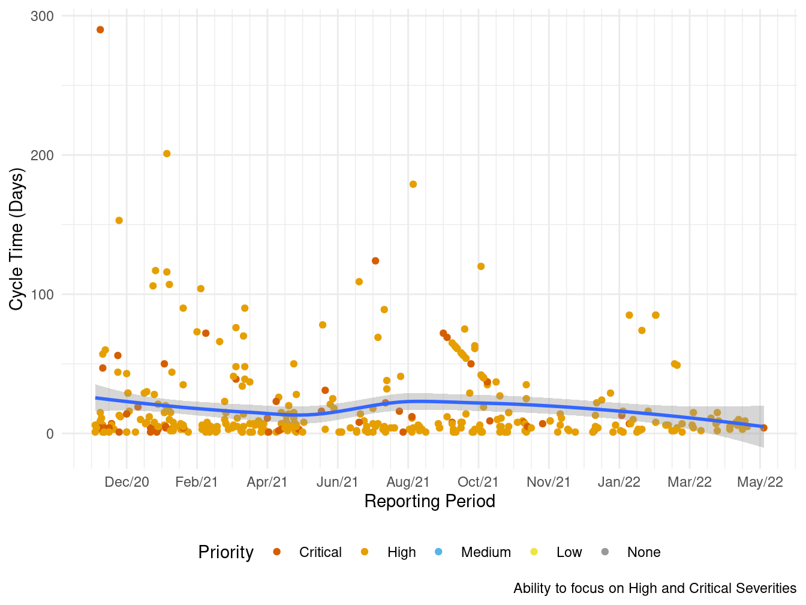
<p class="caption">(\#fig:opics-defects-cycle-time-trend-for-hnc)High and Critical</p>
</div>


<table class="table table-striped" style="width: auto !important; margin-left: auto; margin-right: auto;">
<caption>(\#tab:opics-defects-cycle-time-stat-for-high-and-critical)5 Number Summary for High and Critical Defects</caption>
 <thead>
  <tr>
   <th style="text-align:left;"> Type </th>
   <th style="text-align:left;"> Priority </th>
   <th style="text-align:right;"> Count </th>
   <th style="text-align:right;"> Min </th>
   <th style="text-align:right;"> LoQ </th>
   <th style="text-align:right;"> Med </th>
   <th style="text-align:right;"> UpQ </th>
   <th style="text-align:right;"> Max </th>
  </tr>
 </thead>
<tbody>
  <tr>
   <td style="text-align:left;"> Defect </td>
   <td style="text-align:left;"> Critical </td>
   <td style="text-align:right;"> 53 </td>
   <td style="text-align:right;"> 1 </td>
   <td style="text-align:right;"> 4 </td>
   <td style="text-align:right;"> 7 </td>
   <td style="text-align:right;"> 22 </td>
   <td style="text-align:right;"> 290 </td>
  </tr>
  <tr>
   <td style="text-align:left;"> Defect </td>
   <td style="text-align:left;"> High </td>
   <td style="text-align:right;"> 344 </td>
   <td style="text-align:right;"> 1 </td>
   <td style="text-align:right;"> 3 </td>
   <td style="text-align:right;"> 6 </td>
   <td style="text-align:right;"> 16 </td>
   <td style="text-align:right;"> 201 </td>
  </tr>
</tbody>
</table>


### Throughput


<div class="figure" style="text-align: center">
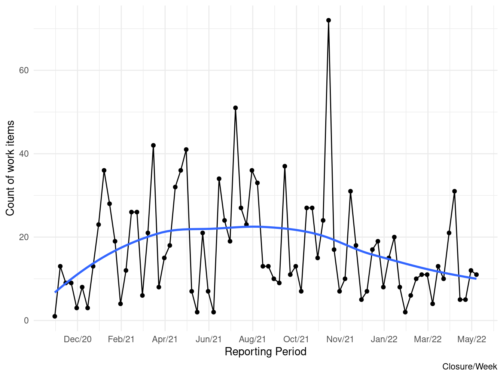
<p class="caption">(\#fig:opics-defects-closed-metric-for-each-week)Closure metrics - All Defects</p>
</div>


<div class="figure" style="text-align: center">
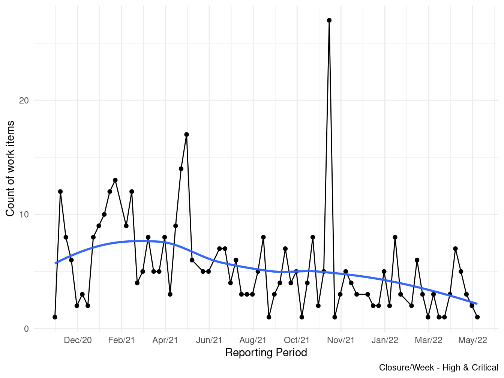
<p class="caption">(\#fig:opics-defects-fig-completed-hnc-defects-week)Closed defects by Week</p>
</div>


The plot below shows the number of defects closed in every week, marked separately in different color based on priority


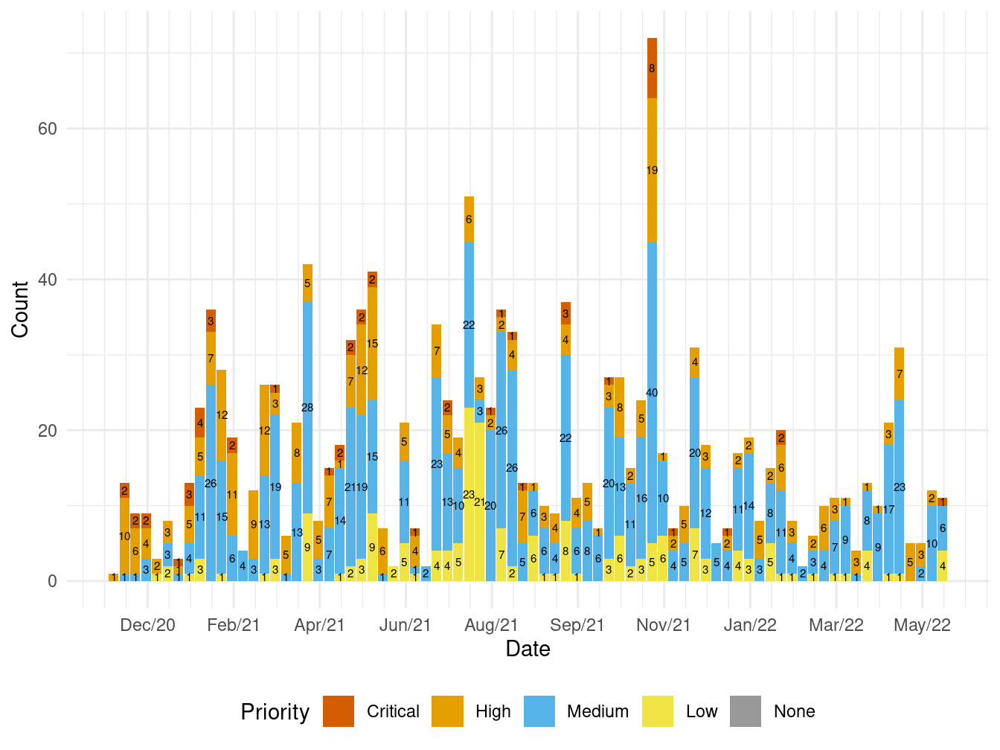

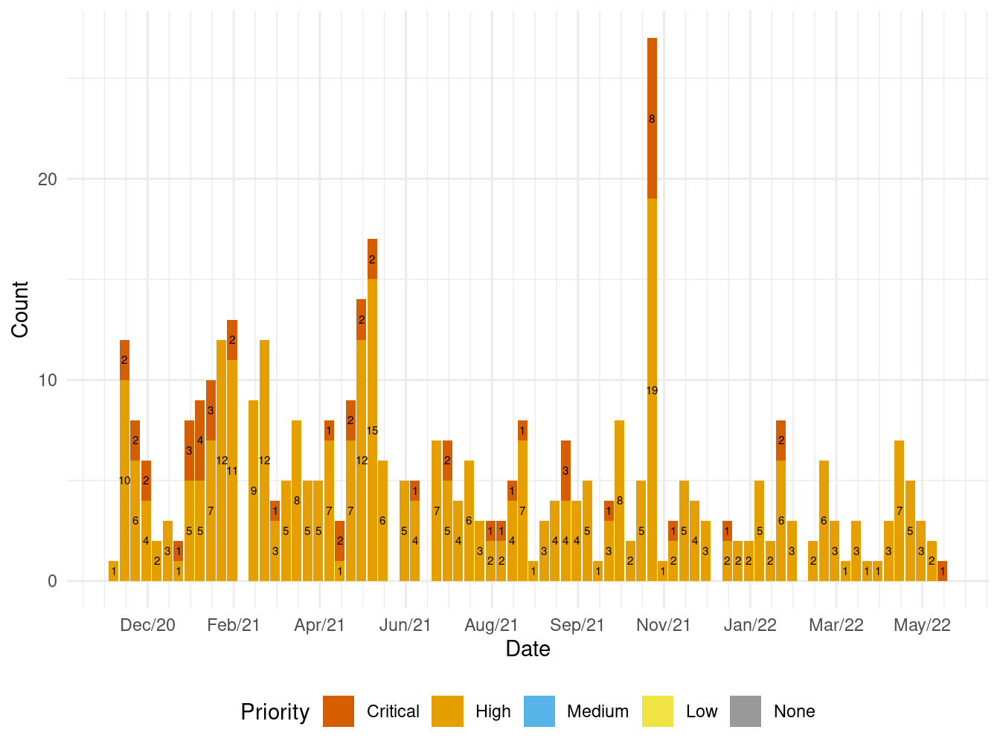


```{=html}
<div id="htmlwidget-d442da54f59ceb545f15" style="width:100%;height:auto;" class="datatables html-widget"></div>
<script type="application/json" data-for="htmlwidget-d442da54f59ceb545f15">{"x":{"filter":"top","vertical":false,"filterHTML":"<tr>\n  <td><\/td>\n  <td data-type=\"date\" style=\"vertical-align: top;\">\n    <div class=\"form-group has-feedback\" style=\"margin-bottom: auto;\">\n      <input type=\"search\" placeholder=\"All\" class=\"form-control\" style=\"width: 100%;\"/>\n      <span class=\"glyphicon glyphicon-remove-circle form-control-feedback\"><\/span>\n    <\/div>\n    <div style=\"display: none;position: absolute;width: 200px;opacity: 1\">\n      <div data-min=\"1.606608e+12\" data-max=\"1653177600000\"><\/div>\n      <span style=\"float: left;\"><\/span>\n      <span style=\"float: right;\"><\/span>\n    <\/div>\n  <\/td>\n  <td data-type=\"factor\" style=\"vertical-align: top;\">\n    <div class=\"form-group has-feedback\" style=\"margin-bottom: auto;\">\n      <input type=\"search\" placeholder=\"All\" class=\"form-control\" style=\"width: 100%;\"/>\n      <span class=\"glyphicon glyphicon-remove-circle form-control-feedback\"><\/span>\n    <\/div>\n    <div style=\"width: 100%; display: none;\">\n      <select multiple=\"multiple\" style=\"width: 100%;\" data-options=\"[&quot;Critical&quot;,&quot;High&quot;,&quot;Medium&quot;,&quot;Low&quot;,&quot;None&quot;]\"><\/select>\n    <\/div>\n  <\/td>\n  <td data-type=\"integer\" style=\"vertical-align: top;\">\n    <div class=\"form-group has-feedback\" style=\"margin-bottom: auto;\">\n      <input type=\"search\" placeholder=\"All\" class=\"form-control\" style=\"width: 100%;\"/>\n      <span class=\"glyphicon glyphicon-remove-circle form-control-feedback\"><\/span>\n    <\/div>\n    <div style=\"display: none;position: absolute;width: 200px;opacity: 1\">\n      <div data-min=\"1\" data-max=\"40\"><\/div>\n      <span style=\"float: left;\"><\/span>\n      <span style=\"float: right;\"><\/span>\n    <\/div>\n  <\/td>\n<\/tr>","data":[["1","2","3","4","5","6","7","8","9","10","11","12","13","14","15","16","17","18","19","20","21","22","23","24","25","26","27","28","29","30","31","32","33","34","35","36","37","38","39","40","41","42","43","44","45","46","47","48","49","50","51","52","53","54","55","56","57","58","59","60","61","62","63","64","65","66","67","68","69","70","71","72","73","74","75","76","77","78","79","80","81","82","83","84","85","86","87","88","89","90","91","92","93","94","95","96","97","98","99","100","101","102","103","104","105","106","107","108","109","110","111","112","113","114","115","116","117","118","119","120","121","122","123","124","125","126","127","128","129","130","131","132","133","134","135","136","137","138","139","140","141","142","143","144","145","146","147","148","149","150","151","152","153","154","155","156","157","158","159","160","161","162","163","164","165","166","167","168","169","170","171","172","173","174","175","176","177","178","179","180","181","182","183","184","185","186","187","188","189","190","191","192","193","194","195","196","197","198","199","200","201","202","203","204","205","206","207","208","209","210","211","212","213","214","215","216","217","218","219","220"],["2020-11-29","2020-12-06","2020-12-06","2020-12-06","2020-12-13","2020-12-13","2020-12-13","2020-12-20","2020-12-20","2020-12-20","2020-12-27","2020-12-27","2021-01-03","2021-01-03","2021-01-03","2021-01-10","2021-01-10","2021-01-10","2021-01-17","2021-01-17","2021-01-17","2021-01-17","2021-01-24","2021-01-24","2021-01-24","2021-01-24","2021-01-31","2021-01-31","2021-01-31","2021-02-07","2021-02-07","2021-02-07","2021-02-14","2021-02-14","2021-02-14","2021-02-21","2021-02-28","2021-02-28","2021-03-07","2021-03-07","2021-03-07","2021-03-14","2021-03-14","2021-03-14","2021-03-14","2021-03-21","2021-03-21","2021-03-28","2021-03-28","2021-04-04","2021-04-04","2021-04-04","2021-04-11","2021-04-11","2021-04-18","2021-04-18","2021-04-18","2021-04-25","2021-04-25","2021-04-25","2021-04-25","2021-05-02","2021-05-02","2021-05-02","2021-05-02","2021-05-09","2021-05-09","2021-05-09","2021-05-09","2021-05-16","2021-05-16","2021-05-16","2021-05-16","2021-05-23","2021-05-23","2021-05-30","2021-06-06","2021-06-06","2021-06-06","2021-06-13","2021-06-13","2021-06-13","2021-06-13","2021-06-20","2021-06-27","2021-06-27","2021-06-27","2021-07-04","2021-07-04","2021-07-04","2021-07-04","2021-07-11","2021-07-11","2021-07-11","2021-07-18","2021-07-18","2021-07-18","2021-07-25","2021-07-25","2021-07-25","2021-08-01","2021-08-01","2021-08-01","2021-08-08","2021-08-08","2021-08-08","2021-08-08","2021-08-15","2021-08-15","2021-08-15","2021-08-15","2021-08-22","2021-08-22","2021-08-22","2021-08-29","2021-08-29","2021-08-29","2021-09-05","2021-09-05","2021-09-05","2021-09-12","2021-09-12","2021-09-12","2021-09-19","2021-09-19","2021-09-19","2021-09-19","2021-09-26","2021-09-26","2021-09-26","2021-10-03","2021-10-03","2021-10-10","2021-10-10","2021-10-17","2021-10-17","2021-10-17","2021-10-17","2021-10-24","2021-10-24","2021-10-24","2021-10-31","2021-10-31","2021-10-31","2021-11-07","2021-11-07","2021-11-07","2021-11-14","2021-11-14","2021-11-14","2021-11-14","2021-11-21","2021-11-21","2021-11-21","2021-11-28","2021-11-28","2021-11-28","2021-12-05","2021-12-05","2021-12-12","2021-12-12","2021-12-12","2021-12-19","2021-12-19","2021-12-19","2021-12-26","2022-01-02","2022-01-02","2022-01-02","2022-01-09","2022-01-09","2022-01-09","2022-01-16","2022-01-16","2022-01-16","2022-01-23","2022-01-23","2022-01-30","2022-01-30","2022-01-30","2022-02-06","2022-02-06","2022-02-06","2022-02-06","2022-02-13","2022-02-13","2022-02-13","2022-02-20","2022-02-27","2022-02-27","2022-02-27","2022-03-06","2022-03-06","2022-03-13","2022-03-13","2022-03-13","2022-03-20","2022-03-20","2022-03-20","2022-03-27","2022-03-27","2022-04-03","2022-04-03","2022-04-03","2022-04-10","2022-04-10","2022-04-17","2022-04-17","2022-04-17","2022-04-24","2022-04-24","2022-04-24","2022-05-01","2022-05-08","2022-05-08","2022-05-15","2022-05-15","2022-05-22","2022-05-22","2022-05-22"],["High","Critical","High","Medium","Critical","High","Medium","Critical","High","Medium","High","Low","High","Medium","Low","Critical","High","Medium","Critical","High","Medium","Low","Critical","High","Medium","Low","Critical","High","Medium","High","Medium","Low","Critical","High","Medium","Medium","High","Medium","High","Medium","Low","Critical","High","Medium","Low","High","Medium","High","Medium","High","Medium","Low","High","Medium","Critical","High","Medium","Critical","High","Medium","Low","Critical","High","Medium","Low","Critical","High","Medium","Low","Critical","High","Medium","Low","High","Medium","Low","High","Medium","Low","Critical","High","Medium","Low","Medium","High","Medium","Low","Critical","High","Medium","Low","High","Medium","Low","High","Medium","Low","High","Medium","Low","Critical","High","Medium","Critical","High","Medium","Low","Critical","High","Medium","Low","Critical","High","Medium","High","Medium","Low","High","Medium","Low","High","Medium","Low","Critical","High","Medium","Low","High","Medium","Low","High","Medium","High","Medium","Critical","High","Medium","Low","High","Medium","Low","High","Medium","Low","High","Medium","Low","Critical","High","Medium","Low","High","Medium","Low","Critical","High","Medium","High","Medium","High","Medium","Low","High","Medium","Low","Medium","Critical","High","Medium","High","Medium","Low","High","Medium","Low","High","Medium","High","Medium","Low","Critical","High","Medium","Low","High","Medium","Low","Medium","High","Medium","Low","High","Medium","High","Medium","Low","High","Medium","Low","High","Medium","High","Medium","Low","High","Medium","High","Medium","Low","High","Medium","Low","High","High","Medium","High","Medium","Critical","Medium","Low"],[1,2,10,1,2,6,1,2,4,3,2,1,3,3,2,1,1,1,3,5,4,1,4,5,11,3,3,7,26,12,15,1,2,11,6,4,9,3,12,13,1,1,3,19,3,5,1,8,13,5,28,9,5,3,1,7,7,2,1,14,1,2,7,21,2,2,12,19,3,2,15,15,9,6,1,2,5,11,5,1,4,1,1,2,7,23,4,2,5,13,4,4,10,5,6,22,23,3,3,21,1,2,20,1,2,26,7,1,4,26,2,1,7,5,1,6,6,3,6,1,4,4,1,3,4,22,8,4,6,1,5,8,1,6,1,3,20,3,8,13,6,2,11,2,5,16,3,8,19,40,5,1,10,6,1,2,4,5,5,4,20,7,3,12,3,5,1,2,4,2,11,4,2,14,3,5,3,2,8,5,2,6,11,1,3,4,1,2,2,3,1,6,4,3,7,1,1,9,1,3,1,1,8,4,1,9,3,17,1,7,23,1,5,3,2,2,10,1,6,4]],"container":"<table class=\"display\">\n  <thead>\n    <tr>\n      <th> <\/th>\n      <th>FloorDate<\/th>\n      <th>Priority<\/th>\n      <th>NumClosed<\/th>\n    <\/tr>\n  <\/thead>\n<\/table>","options":{"columnDefs":[{"className":"dt-right","targets":3},{"orderable":false,"targets":0}],"order":[],"autoWidth":false,"orderClasses":false,"orderCellsTop":true}},"evals":[],"jsHooks":[]}</script>
```

- Density distribution

Gives and indication of the densities especially the occurrence of multiple maxima in the data. This can be due to multiple categories of work items which may be investigated further. Below are the violin plots for all defects and also high and critical defects.

<div class="figure" style="text-align: center">
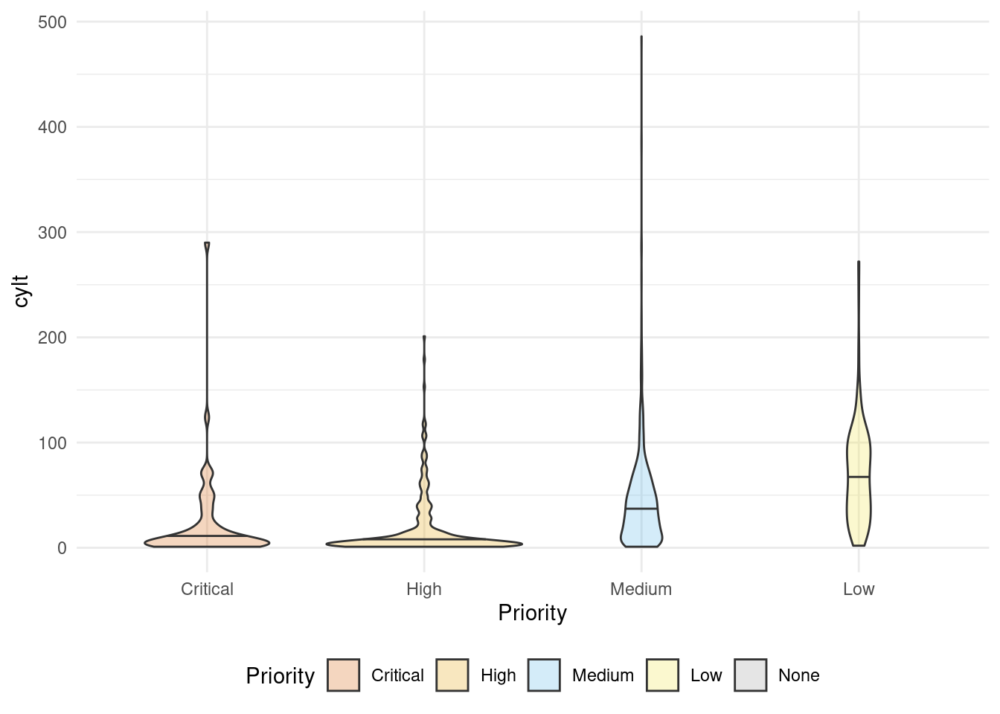
<p class="caption">(\#fig:opics-defects-fig-densdist-closed-overall)Priority based Density Distribution</p>
</div>


### Flow

#### Work in Progress (WiP)

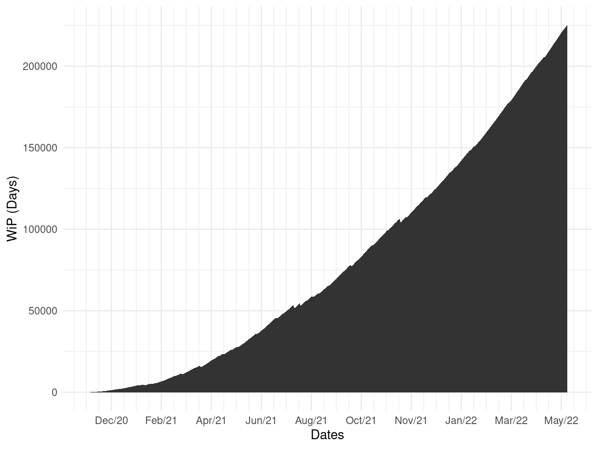

#### Inflow Outflow

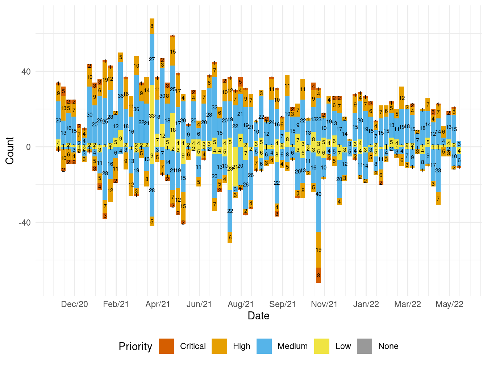

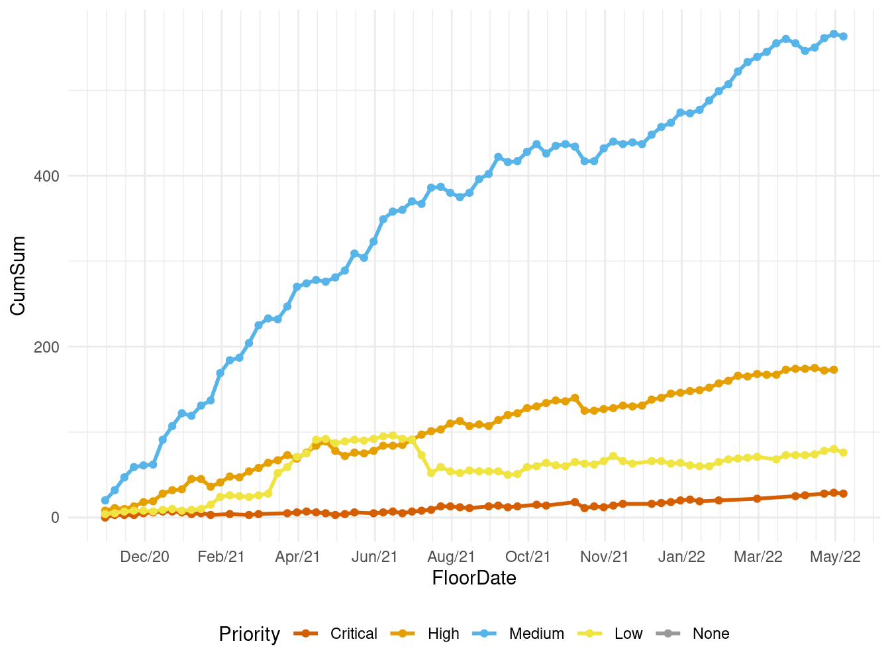


```{=html}
<div id="htmlwidget-e4336c962577166f1b52" style="width:100%;height:auto;" class="datatables html-widget"></div>
<script type="application/json" data-for="htmlwidget-e4336c962577166f1b52">{"x":{"filter":"top","vertical":false,"filterHTML":"<tr>\n  <td><\/td>\n  <td data-type=\"date\" style=\"vertical-align: top;\">\n    <div class=\"form-group has-feedback\" style=\"margin-bottom: auto;\">\n      <input type=\"search\" placeholder=\"All\" class=\"form-control\" style=\"width: 100%;\"/>\n      <span class=\"glyphicon glyphicon-remove-circle form-control-feedback\"><\/span>\n    <\/div>\n    <div style=\"display: none;position: absolute;width: 200px;opacity: 1\">\n      <div data-min=\"1.606608e+12\" data-max=\"1653177600000\"><\/div>\n      <span style=\"float: left;\"><\/span>\n      <span style=\"float: right;\"><\/span>\n    <\/div>\n  <\/td>\n  <td data-type=\"factor\" style=\"vertical-align: top;\">\n    <div class=\"form-group has-feedback\" style=\"margin-bottom: auto;\">\n      <input type=\"search\" placeholder=\"All\" class=\"form-control\" style=\"width: 100%;\"/>\n      <span class=\"glyphicon glyphicon-remove-circle form-control-feedback\"><\/span>\n    <\/div>\n    <div style=\"width: 100%; display: none;\">\n      <select multiple=\"multiple\" style=\"width: 100%;\" data-options=\"[&quot;Critical&quot;,&quot;High&quot;,&quot;Medium&quot;,&quot;Low&quot;,&quot;None&quot;]\"><\/select>\n    <\/div>\n  <\/td>\n  <td data-type=\"number\" style=\"vertical-align: top;\">\n    <div class=\"form-group has-feedback\" style=\"margin-bottom: auto;\">\n      <input type=\"search\" placeholder=\"All\" class=\"form-control\" style=\"width: 100%;\"/>\n      <span class=\"glyphicon glyphicon-remove-circle form-control-feedback\"><\/span>\n    <\/div>\n    <div style=\"display: none;position: absolute;width: 200px;opacity: 1\">\n      <div data-min=\"0\" data-max=\"36\"><\/div>\n      <span style=\"float: left;\"><\/span>\n      <span style=\"float: right;\"><\/span>\n    <\/div>\n  <\/td>\n  <td data-type=\"number\" style=\"vertical-align: top;\">\n    <div class=\"form-group has-feedback\" style=\"margin-bottom: auto;\">\n      <input type=\"search\" placeholder=\"All\" class=\"form-control\" style=\"width: 100%;\"/>\n      <span class=\"glyphicon glyphicon-remove-circle form-control-feedback\"><\/span>\n    <\/div>\n    <div style=\"display: none;position: absolute;width: 200px;opacity: 1\">\n      <div data-min=\"0\" data-max=\"40\"><\/div>\n      <span style=\"float: left;\"><\/span>\n      <span style=\"float: right;\"><\/span>\n    <\/div>\n  <\/td>\n  <td data-type=\"number\" style=\"vertical-align: top;\">\n    <div class=\"form-group has-feedback\" style=\"margin-bottom: auto;\">\n      <input type=\"search\" placeholder=\"All\" class=\"form-control\" style=\"width: 100%;\"/>\n      <span class=\"glyphicon glyphicon-remove-circle form-control-feedback\"><\/span>\n    <\/div>\n    <div style=\"display: none;position: absolute;width: 200px;opacity: 1\">\n      <div data-min=\"0\" data-max=\"566\"><\/div>\n      <span style=\"float: left;\"><\/span>\n      <span style=\"float: right;\"><\/span>\n    <\/div>\n  <\/td>\n<\/tr>","data":[["1","2","3","4","5","6","7","8","9","10","11","12","13","14","15","16","17","18","19","20","21","22","23","24","25","26","27","28","29","30","31","32","33","34","35","36","37","38","39","40","41","42","43","44","45","46","47","48","49","50","51","52","53","54","55","56","57","58","59","60","61","62","63","64","65","66","67","68","69","70","71","72","73","74","75","76","77","78","79","80","81","82","83","84","85","86","87","88","89","90","91","92","93","94","95","96","97","98","99","100","101","102","103","104","105","106","107","108","109","110","111","112","113","114","115","116","117","118","119","120","121","122","123","124","125","126","127","128","129","130","131","132","133","134","135","136","137","138","139","140","141","142","143","144","145","146","147","148","149","150","151","152","153","154","155","156","157","158","159","160","161","162","163","164","165","166","167","168","169","170","171","172","173","174","175","176","177","178","179","180","181","182","183","184","185","186","187","188","189","190","191","192","193","194","195","196","197","198","199","200","201","202","203","204","205","206","207","208","209","210","211","212","213","214","215","216","217","218","219","220","221","222","223","224","225","226","227","228","229","230","231","232","233","234","235","236","237","238","239","240","241","242","243","244","245","246","247","248","249","250","251","252","253","254","255","256","257","258","259","260","261","262","263","264","265","266","267","268","269","270","271","272","273","274","275","276","277","278","279","280","281","282","283","284","285","286","287","288","289","290"],["2020-11-29","2020-11-29","2020-11-29","2020-11-29","2020-12-06","2020-12-06","2020-12-06","2020-12-06","2020-12-13","2020-12-13","2020-12-13","2020-12-13","2020-12-20","2020-12-20","2020-12-20","2020-12-20","2020-12-27","2020-12-27","2020-12-27","2020-12-27","2021-01-03","2021-01-03","2021-01-03","2021-01-03","2021-01-10","2021-01-10","2021-01-10","2021-01-10","2021-01-17","2021-01-17","2021-01-17","2021-01-17","2021-01-24","2021-01-24","2021-01-24","2021-01-24","2021-01-31","2021-01-31","2021-01-31","2021-01-31","2021-02-07","2021-02-07","2021-02-07","2021-02-07","2021-02-14","2021-02-14","2021-02-14","2021-02-14","2021-02-21","2021-02-21","2021-02-21","2021-02-28","2021-02-28","2021-02-28","2021-02-28","2021-03-07","2021-03-07","2021-03-07","2021-03-14","2021-03-14","2021-03-14","2021-03-14","2021-03-21","2021-03-21","2021-03-21","2021-03-21","2021-03-28","2021-03-28","2021-03-28","2021-04-04","2021-04-04","2021-04-04","2021-04-11","2021-04-11","2021-04-11","2021-04-11","2021-04-18","2021-04-18","2021-04-18","2021-04-18","2021-04-25","2021-04-25","2021-04-25","2021-04-25","2021-05-02","2021-05-02","2021-05-02","2021-05-02","2021-05-09","2021-05-09","2021-05-09","2021-05-09","2021-05-16","2021-05-16","2021-05-16","2021-05-16","2021-05-23","2021-05-23","2021-05-23","2021-05-23","2021-05-30","2021-05-30","2021-05-30","2021-05-30","2021-06-06","2021-06-06","2021-06-06","2021-06-13","2021-06-13","2021-06-13","2021-06-13","2021-06-20","2021-06-20","2021-06-20","2021-06-20","2021-06-27","2021-06-27","2021-06-27","2021-06-27","2021-07-04","2021-07-04","2021-07-04","2021-07-04","2021-07-11","2021-07-11","2021-07-11","2021-07-11","2021-07-18","2021-07-18","2021-07-18","2021-07-18","2021-07-25","2021-07-25","2021-07-25","2021-07-25","2021-08-01","2021-08-01","2021-08-01","2021-08-01","2021-08-08","2021-08-08","2021-08-08","2021-08-08","2021-08-15","2021-08-15","2021-08-15","2021-08-15","2021-08-22","2021-08-22","2021-08-22","2021-08-22","2021-08-29","2021-08-29","2021-08-29","2021-09-05","2021-09-05","2021-09-05","2021-09-05","2021-09-12","2021-09-12","2021-09-12","2021-09-12","2021-09-19","2021-09-19","2021-09-19","2021-09-19","2021-09-26","2021-09-26","2021-09-26","2021-09-26","2021-10-03","2021-10-03","2021-10-03","2021-10-10","2021-10-10","2021-10-10","2021-10-10","2021-10-17","2021-10-17","2021-10-17","2021-10-17","2021-10-24","2021-10-24","2021-10-24","2021-10-31","2021-10-31","2021-10-31","2021-11-07","2021-11-07","2021-11-07","2021-11-07","2021-11-14","2021-11-14","2021-11-14","2021-11-14","2021-11-21","2021-11-21","2021-11-21","2021-11-21","2021-11-28","2021-11-28","2021-11-28","2021-11-28","2021-12-05","2021-12-05","2021-12-05","2021-12-05","2021-12-12","2021-12-12","2021-12-12","2021-12-12","2021-12-19","2021-12-19","2021-12-19","2021-12-26","2021-12-26","2022-01-02","2022-01-02","2022-01-02","2022-01-02","2022-01-09","2022-01-09","2022-01-09","2022-01-09","2022-01-16","2022-01-16","2022-01-16","2022-01-16","2022-01-23","2022-01-23","2022-01-23","2022-01-23","2022-01-30","2022-01-30","2022-01-30","2022-01-30","2022-02-06","2022-02-06","2022-02-06","2022-02-06","2022-02-13","2022-02-13","2022-02-13","2022-02-20","2022-02-20","2022-02-20","2022-02-20","2022-02-27","2022-02-27","2022-02-27","2022-03-06","2022-03-06","2022-03-06","2022-03-13","2022-03-13","2022-03-13","2022-03-20","2022-03-20","2022-03-20","2022-03-20","2022-03-27","2022-03-27","2022-04-03","2022-04-03","2022-04-03","2022-04-10","2022-04-10","2022-04-10","2022-04-17","2022-04-17","2022-04-17","2022-04-17","2022-04-24","2022-04-24","2022-04-24","2022-04-24","2022-05-01","2022-05-01","2022-05-01","2022-05-08","2022-05-08","2022-05-08","2022-05-08","2022-05-15","2022-05-15","2022-05-15","2022-05-15","2022-05-22","2022-05-22","2022-05-22"],["Critical","High","Medium","Low","Critical","High","Medium","Low","Critical","High","Medium","Low","Critical","High","Medium","Low","Critical","High","Medium","Low","Critical","High","Medium","Low","Critical","High","Medium","Low","Critical","High","Medium","Low","Critical","High","Medium","Low","Critical","High","Medium","Low","Critical","High","Medium","Low","Critical","High","Medium","Low","High","Medium","Low","Critical","High","Medium","Low","High","Medium","Low","Critical","High","Medium","Low","Critical","High","Medium","Low","High","Medium","Low","High","Medium","Low","Critical","High","Medium","Low","Critical","High","Medium","Low","Critical","High","Medium","Low","Critical","High","Medium","Low","Critical","High","Medium","Low","Critical","High","Medium","Low","Critical","High","Medium","Low","Critical","High","Medium","Low","High","Medium","Low","Critical","High","Medium","Low","Critical","High","Medium","Low","Critical","High","Medium","Low","Critical","High","Medium","Low","Critical","High","Medium","Low","Critical","High","Medium","Low","Critical","High","Medium","Low","Critical","High","Medium","Low","Critical","High","Medium","Low","Critical","High","Medium","Low","Critical","High","Medium","Low","High","Medium","Low","Critical","High","Medium","Low","Critical","High","Medium","Low","Critical","High","Medium","Low","Critical","High","Medium","Low","High","Medium","Low","Critical","High","Medium","Low","Critical","High","Medium","Low","High","Medium","Low","High","Medium","Low","Critical","High","Medium","Low","Critical","High","Medium","Low","Critical","High","Medium","Low","Critical","High","Medium","Low","Critical","High","Medium","Low","Critical","High","Medium","Low","High","Medium","Low","High","Medium","Critical","High","Medium","Low","Critical","High","Medium","Low","Critical","High","Medium","Low","Critical","High","Medium","Low","Critical","High","Medium","Low","Critical","High","Medium","Low","High","Medium","Low","Critical","High","Medium","Low","High","Medium","Low","High","Medium","Low","High","Medium","Low","Critical","High","Medium","Low","High","Medium","High","Medium","Low","High","Medium","Low","Critical","High","Medium","Low","Critical","High","Medium","Low","High","Medium","Low","Critical","High","Medium","Low","Critical","High","Medium","Low","Critical","Medium","Low"],[1,9,20,4,5,13,13,1,2,5,16,2,2,7,15,1,2,7,2,1,1,4,4,1,2,10,30,2,3,9,20,2,3,6,26,1,1,19,25,1,1,12,28,2,0,2,12,5,5,36,9,1,16,18,2,11,16,0,0,10,36,2,1,9,22,2,14,21,2,8,27,33,1,11,18,7,2,3,30,12,3,8,18,5,1,15,25,18,1,17,17,4,0,4,20,4,1,0,9,2,2,4,20,4,4,6,4,0,7,20,3,1,6,28,3,1,7,32,5,0,6,15,0,2,10,20,4,1,12,19,5,1,7,22,0,5,4,21,7,1,9,19,2,0,7,21,0,0,1,10,3,3,22,5,2,1,12,1,1,11,24,1,1,10,16,4,1,6,7,2,11,19,8,2,3,15,1,0,7,9,7,11,22,3,1,13,1,4,9,13,8,1,4,23,3,2,1,10,5,0,4,19,4,2,6,13,6,2,7,17,1,2,14,0,1,3,1,9,15,3,1,4,20,4,1,7,19,0,2,6,15,1,1,4,7,2,0,7,15,0,6,15,1,1,5,13,5,5,11,4,12,19,1,2,18,2,2,4,15,2,2,7,1,18,1,7,14,5,3,4,12,1,1,7,14,1,6,4,1,2,0,13,4,1,3,15,2,0,3,0],[1,1,0,0,2,10,1,0,2,6,1,0,2,4,3,0,0,2,0,1,0,3,3,2,1,1,1,0,3,5,4,1,4,5,11,3,3,7,28,0,0,12,16,1,2,11,6,0,0,4,0,0,9,3,0,12,13,1,1,3,19,3,0,5,1,0,8,13,0,5,28,9,0,5,3,0,1,7,7,0,2,1,14,1,2,7,21,2,2,12,19,3,2,15,15,9,0,6,1,0,0,0,0,2,5,11,5,1,4,1,1,0,0,2,0,0,7,23,4,2,5,13,4,0,4,10,5,0,6,22,23,0,3,3,21,1,2,20,0,1,2,26,7,1,4,26,2,1,7,5,0,1,6,6,0,3,6,1,0,4,4,1,3,4,22,8,0,4,6,1,5,8,0,0,1,6,0,1,3,20,3,8,13,6,2,11,2,0,5,16,3,8,19,40,5,0,1,10,6,1,2,4,0,0,5,5,0,0,4,20,7,3,12,3,0,5,1,2,4,0,0,2,11,4,0,2,14,3,0,5,3,0,0,2,8,5,2,6,11,1,3,4,1,0,0,2,0,2,3,1,6,4,0,3,7,1,0,1,9,1,3,1,1,8,4,1,9,0,0,3,17,1,0,7,23,1,5,0,0,0,3,2,0,0,2,10,0,1,6,4],[0,8,20,4,3,11,32,5,3,10,47,7,3,13,59,8,5,18,61,8,6,19,62,7,7,28,91,9,7,32,107,10,6,33,122,8,4,45,119,9,5,45,131,10,3,36,137,15,41,169,24,4,48,184,26,47,187,25,3,54,204,24,4,58,225,26,64,233,28,67,232,52,5,73,247,59,6,69,270,71,7,76,274,75,6,84,278,91,5,89,276,92,3,78,281,87,4,72,289,89,6,76,309,91,75,304,90,5,78,323,92,6,84,349,95,7,84,358,96,5,85,360,92,7,91,370,91,8,97,367,73,9,101,386,52,13,103,387,59,13,110,380,54,12,113,375,52,11,107,380,55,109,396,54,13,107,402,54,14,114,422,54,12,120,416,50,13,122,417,51,128,428,59,15,130,437,60,14,134,426,64,137,435,61,136,437,60,18,140,434,65,11,125,417,63,13,125,417,62,12,127,432,66,14,128,440,72,16,131,437,66,130,439,63,131,437,16,138,448,66,17,140,457,66,18,145,462,63,20,146,474,64,21,148,473,61,19,149,477,60,152,488,60,20,157,499,65,160,507,68,166,522,69,165,533,70,22,168,539,71,167,545,167,555,68,173,560,73,25,174,555,73,26,174,546,73,175,550,74,28,172,561,78,29,173,566,80,28,563,76]],"container":"<table class=\"display\">\n  <thead>\n    <tr>\n      <th> <\/th>\n      <th>FloorDate<\/th>\n      <th>Priority<\/th>\n      <th>Opened<\/th>\n      <th>Closed<\/th>\n      <th>CumSum<\/th>\n    <\/tr>\n  <\/thead>\n<\/table>","options":{"columnDefs":[{"className":"dt-right","targets":[3,4,5]},{"orderable":false,"targets":0}],"order":[],"autoWidth":false,"orderClasses":false,"orderCellsTop":true}},"evals":[],"jsHooks":[]}</script>
```
